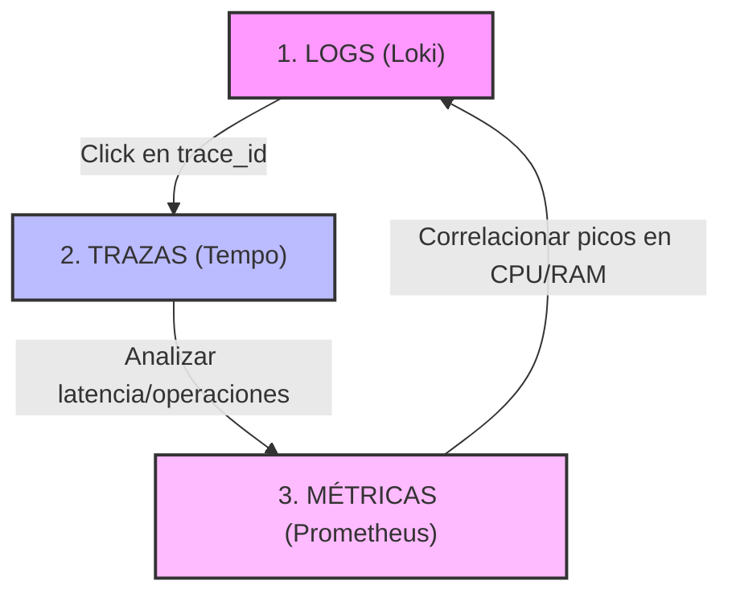

# Centralización de Logs con OpenTelemetry (LGTM)

> *Guía práctica para implementar una solución de centralización de logs utilizando Docker Compose y OpenTelemetry, como instanciación concreta de la arquitectura conceptual de observabilidad presentada en el documento central.*

## Objetivo de la guía

Implementar y validar una arquitectura de centralización de logs mediante **Docker Compose**, usando **OpenTelemetry** para la recolección y exportación de logs vía el protocolo **OTLP**, y **Grafana** (integrado en el stack `grafana/otel-lgtm`) como herramienta de exploración.

## Resultados de aprendizaje esperados

Al finalizar esta guía, el estudiante será capaz de:

- Identificar los componentes del stack `grafana/otel-lgtm` y el papel del OTel Collector.
- Relacionar conceptos teóricos de observabilidad con una implementación práctica basada en OpenTelemetry.
- Configurar aplicaciones Quarkus para exportar logs mediante OTLP/gRPC.
- Configurar aplicaciones Java (Logback) para enviar logs usando el agente de OpenTelemetry.
- Explorar y correlacionar logs centralizados desde Grafana, aprovechando campos como `trace_id`, `span_id` y `exception_stacktrace`.

## Propósito y alcance del recurso

El propósito principal de este recurso es guiar el despliegue y uso de una **arquitectura de centralización de logs** basada en el estándar OpenTelemetry, en un entorno local y reproducible mediante Docker Compose.

El material está concebido como:

- Un **recurso educativo aplicado**, orientado a cursos de arquitectura de software, microservicios, DevOps y observabilidad.
- Un **entorno de laboratorio reproducible**, que permite experimentar con flujos reales de generación, centralización y análisis de logs.
- Un **caso de estudio técnico**, que ilustra cómo OpenTelemetry enriquece automáticamente los logs con atributos de trazabilidad (`trace_id`, `span_id`), contexto de código (`code_namespace`, `code_function`, `code_lineno`) y excepciones estructuradas (`exception_stacktrace`, `exception_message`).

El alcance del recurso se limita a la **centralización y visualización de logs**. El stack LGTM también soporta métricas y trazas distribuidas, lo cual sienta bases para integraciones futuras.

## 1. Observabilidad y centralización de logs con OpenTelemetry

En arquitecturas basadas en microservicios, la observabilidad permite comprender el comportamiento interno del sistema a partir de señales externas. Los **logs** constituyen una fuente primaria de información debido a su riqueza semántica y contextual.

Todas las guías anteriores resolvían la observabilidad con herramientas concretas, cada una con su propio formato y su propio protocolo. Esto plantea un problema de fondo: si mañana quieres cambiar de herramienta de almacenamiento, tendrías que reinstrumentar tus aplicaciones. OpenTelemetry (OTel) nace precisamente para romper ese acoplamiento.

### OpenTelemetry: el estándar que desacopla la instrumentación del backend

OpenTelemetry no es una herramienta de almacenamiento ni un visualizador: es un **estándar abierto y neutral respecto al proveedor** (*vendor-neutral*). Define un conjunto de APIs, SDKs y herramientas para capturar y exportar las señales de observabilidad —**logs, métricas y trazas**, los tres pilares del marco conceptual (§5.1)— y transmitirlas mediante un protocolo común, el **OTLP (OpenTelemetry Protocol)**.

¿Por qué es esto importante? Porque separa dos responsabilidades que antes estaban entrelazadas:

- *cómo se instrumenta* una aplicación (responsabilidad de OTel, una sola vez);
- *a dónde se envían* los datos (un simple detalle de configuración del backend).

Instrumentas una vez con OpenTelemetry y puedes cambiar de backend de almacenamiento sin tocar el código de tus servicios. Es el mismo principio de neutralidad tecnológica que defiende el marco conceptual de este recurso, llevado al plano de la instrumentación.

Una ventaja concreta de este enfoque es la **correlación automática** entre señales: los logs generados durante una petición HTTP llevan automáticamente el `trace_id` y el `span_id` de la traza activa, lo que permite navegar desde un log hacia la traza distribuida correspondiente y viceversa. Recordarás del marco conceptual (§5.3) que la correlación de eventos era uno de los grandes problemas de la dispersión; OpenTelemetry lo resuelve de raíz, propagando el contexto de traza de forma transparente.

## 2. Requisitos previos

- Docker instalado  
  https://docs.docker.com/engine/install/
- Docker Compose  
  https://docs.docker.com/compose/install/
- Al menos **8 GB de RAM** libres

### Dimensionamiento de recursos

El stack tiene un **consumo estimado de ~3 GB de RAM en estado estable**. Para evitar que un contenedor agote la memoria del host, cada servicio define un límite explícito mediante `mem_limit`:

| Servicio | Función en el pipeline | `mem_limit` por defecto |
|----------|------------------------|-------------------------|
| `otel-lgtm` | Imagen todo-en-uno: OTel Collector + Loki + Prometheus + Tempo + Grafana | `2g` |
| `logs.producer` | Aplicación Quarkus que genera y exporta logs vía OTLP | `512m` |

Estos límites son **parametrizables mediante un archivo `.env`** ubicado junto al `docker-compose.yml`, lo que permite ajustarlos según los recursos disponibles del host:

```bash
OTEL_LGTM_MEM_LIMIT=2g
PRODUCER_MEM_LIMIT=512m
```

## 3. Estructura del proyecto

```bash
logs-centralizados/
├── docker-compose.yml
└── logs.producer/
    ├── src/
    └── pom.xml
```

## 4. Arquitectura de la solución

```text
[Aplicaciones Java / Quarkus]
          |
          |  OTLP (gRPC :4317)
          v
[OTel Collector — grafana/otel-lgtm:0.27.1]
          |
     _____|_______________________________
     |            |           |          |
     v            v           v          v
  [Loki]    [Prometheus]  [Tempo]  [Grafana :3000]
(logs)       (métricas)   (trazas) (visualización)
```

La arquitectura implementada se fundamenta en:

- **OpenTelemetry Collector**: recibe señales de observabilidad vía OTLP (gRPC puerto 4317 / HTTP puerto 4318) y las distribuye a los backends correspondientes.
- **Loki**: almacena los logs indexando solo etiquetas (labels). Los atributos OTel (`service_name`, `severity_text`, `trace_id`, etc.) se convierten en labels.
- **Prometheus**: almacena métricas.
- **Tempo**: almacena trazas distribuidas.
- **Grafana**: capa de visualización unificada para las tres señales.
- **`grafana/otel-lgtm`**: imagen todo-en-uno que empaqueta el Collector y el stack LGTM completo, pensada para entornos de desarrollo y laboratorio.

## 5. Implementación de la arquitectura conceptual con OpenTelemetry

### 5.1 docker-compose.yml

```yaml
services:
  logs.producer:
    build:
      context: logs.producer
      dockerfile: src/main/docker/Dockerfile.compose
    ports:
      - "8080:8080"
    environment:
      OTEL_HOST: otel-lgtm
    mem_limit: ${PRODUCER_MEM_LIMIT:-512m}
    depends_on:
      otel-lgtm:
        condition: service_healthy

  otel-lgtm:
    image: grafana/otel-lgtm:0.27.1
    container_name: otel-lgtm
    mem_limit: ${OTEL_LGTM_MEM_LIMIT:-2g}
    ports:
      - "3000:3000"
      - "3100:3100"
      - "4317:4317"
      - "4318:4318"
    healthcheck:
      test: ["CMD-SHELL", "test -f /tmp/ready || exit 1"]
      interval: 5s
      timeout: 3s
      retries: 20
      start_period: 15s
```

> [!NOTE]
> **El healthcheck:** La imagen `grafana/otel-lgtm` no incluye `curl` ni `wget`. Internamente crea el archivo `/tmp/ready` cuando todos sus servicios están listos. El healthcheck verifica ese archivo.

## 6. Despliegue y validación

### Inicialización de los servicios

```bash
docker compose up -d
```

### Validación de los servicios

```bash
docker compose ps
```

Salida esperada (referencial):

```text
NAME                      STATUS
otel-lgtm                 Up (healthy)
logs.producer-1           Up
```

## 7. Emisión de logs desde aplicaciones

### 7.1 Aplicaciones Quarkus

El recurso contempla un ejemplo de integración con aplicaciones desarrolladas en **Quarkus**, utilizando la extensión `quarkus-opentelemetry` que exporta logs directamente al OTel Collector mediante **OTLP/gRPC**.

- En caso de no tener una aplicación puede crear con el siguiente comando.

```shell
mvn io.quarkus.platform:quarkus-maven-plugin:3.18.4:create \
    -DprojectGroupId=co.uniquindio.ingesis.logs \
    -DprojectArtifactId=logs.producer \
    -Dextensions='rest,opentelemetry' \
    -DnoCode
```

- Configure su aplicación para que los logs sean enviados al OTel Collector. (**`application.properties`**)

```properties
quarkus.application.name=logs-producer

# OpenTelemetry: exportar logs via OTLP gRPC
quarkus.otel.logs.enabled=true
# OTEL_HOST defaults to localhost (dev/IDE); docker compose overrides to "otel-lgtm"
quarkus.otel.exporter.otlp.endpoint=http://${OTEL_HOST:localhost}:4317
```

> [!NOTE]
> La propiedad `quarkus.otel.exporter.otlp.endpoint` configura el endpoint para todas las señales (logs, métricas, trazas). Al habilitar `quarkus.otel.logs.enabled=true`, los logs del JBoss LogManager son interceptados y exportados vía OTLP. No se requiere ninguna otra extensión de logging.

**Uso del logger:**

```java
private static final Logger LOG = Logger.getLogger(MiClase.class);
```

### 7.2 Otras aplicaciones Java (agente OpenTelemetry)

Para aplicaciones Java que no utilizan Quarkus, la forma más simple de integrar OpenTelemetry es mediante el **agente de instrumentación automática**, que intercepta los logs de Logback/Log4j2 sin modificar el código:

```bash
# Descargar el agente
curl -L https://github.com/open-telemetry/opentelemetry-java-instrumentation/releases/latest/download/opentelemetry-javaagent.jar \
     -o opentelemetry-javaagent.jar

# Ejecutar la aplicación con el agente
java -javaagent:opentelemetry-javaagent.jar \
     -Dotel.service.name=mi-servicio \
     -Dotel.exporter.otlp.endpoint=http://localhost:4317 \
     -Dotel.logs.exporter=otlp \
     -jar myapp.jar
```

> El agente intercepta automáticamente Logback, Log4j2, JUL y JBoss Logging, sin necesidad de modificar `logback.xml` ni el código de la aplicación.

## 8. Visualización en Grafana

Acceda a Grafana en `http://localhost:3000` con usuario `admin` y contraseña `admin`.

### 8.1 Ruta sugerida para logs

**Drilldown → Logs**

Desde allí puede filtrar por `service_name`, nivel (`severity_text`) y buscar por contenido.

### 8.2 Consultas LogQL de ejemplo

Todos los logs del servicio:
```logql
{service_name="logs-producer"}
```

Filtrar solo errores:
```logql
{service_name="logs-producer", severity_text="ERROR"}
```

Buscar excepciones por contenido:
```logql
{service_name="logs-producer"} |= "NullPointerException"
```

Ver mensajes formateados:
```logql
{service_name="logs-producer"} | logfmt
```

### 8.3 La Trinidad de la Observabilidad en Acción (Correlación Cruzada)

El protocolo **OTLP (OpenTelemetry Protocol)** permite unificar el envío de logs, métricas y trazas distribuidas. En Grafana, esto habilita el flujo de diagnóstico definitivo: la **correlación cruzada**.

Usted puede rastrear un problema en caliente cruzando las tres señales de la siguiente manera:



#### Paso 1: Detección a través de logs (Loki)
1. Ingrese a **Explore** en Grafana (`http://localhost:3000`) y seleccione el datasource **Loki**.
2. Ejecute la consulta LogQL `{service_name="logs-producer", severity_text="ERROR"}`.
3. Localice el log de error generado por el NPE al llamar a `GET http://localhost:8080/api/error`.
4. Al hacer clic sobre la línea del log para expandir sus metadatos estructurados, observará que OpenTelemetry inyectó automáticamente los campos `trace_id` y `span_id` en el contexto.

#### Paso 2: Navegación contextual a la traza (Tempo)
1. En el desglose del log expandido, Grafana reconocerá el valor del campo `trace_id` y presentará un botón interactivo llamado **`Tempo`** al lado del hash.
2. Al hacer clic en este botón, la pantalla se dividirá en dos (*Split View*):
    * **Panel Izquierdo**: El log de Loki detallando la excepción `NullPointerException`.
    * **Panel Derecho**: La representación visual del ciclo de vida de la petición HTTP en **Tempo** correspondiente a ese `trace_id` exacto.
3. En el panel derecho de Tempo podrá observar de forma gráfica:
    * El *span* raíz de la petición (`GET /api/error`).
    * El *span* interno del microservicio Quarkus.
    * La duración exacta de la llamada en milisegundos y el estado de error (marcado en rojo).
    * Al expandir el span de la traza, verá los logs y los eventos de excepción incrustados en la línea de tiempo exacta donde ocurrieron.

#### Paso 3: Correlación temporal con el comportamiento del sistema (Prometheus)
1. La observabilidad unificada cobra verdadero sentido cuando cruzamos esta latencia o error con el rendimiento físico del hardware.
2. Desde la misma interfaz Explore de Grafana, configure un tercer panel con el datasource **Prometheus**.
3. Ingrese las siguientes consultas PromQL sobre la misma ventana de tiempo del incidente:
    * **Tasa de errores por segundo**:
      ```promql
      sum(rate(http_server_duration_milliseconds_count{status=~"5.."}[1m])) by (uri)
      ```
    * **Uso de CPU del proceso**:
      ```promql
      process_cpu_usage{service_name="logs-producer"}
      ```
    * **Consumo de Memoria Heap de la JVM**:
      ```promql
      jvm_memory_used_bytes{area="heap", service_name="logs-producer"}
      ```
4. Observe la coincidencia exacta: el pico en la gráfica de errores HTTP en Prometheus se alinea perfectamente a nivel de segundo con el timestamp del log en Loki y la duración anómala registrada en Tempo.

Este nivel de integración elimina la necesidad de adivinar qué causó un pico de CPU o qué petición provocó una fuga de memoria, materializando de forma práctica la arquitectura de observabilidad conceptual del laboratorio.

## 9. Actividades de profundización

- **Simular fallos y rastrear su origen:** El endpoint `GET /api/error` genera intencionalmente una `NullPointerException`. Ejecútelo y localice en Grafana el evento de error. Observe el campo `exception_stacktrace` exportado como atributo estructurado, así como el `trace_id` que correlaciona el log con la traza HTTP.
- Comparar la riqueza semántica de los logs OTel (con `trace_id`, `span_id`, `code_namespace`) frente a los enfoques basados en texto plano o GELF.
- Explorar las métricas exportadas automáticamente por Quarkus (JVM, HTTP requests) en la sección de **Prometheus** de Grafana.
- Desplegar dos instancias de `logs.producer` con distintos `quarkus.application.name` y distinguirlas por `service_name` en LogQL.
- Analizar la diferencia entre `severity_text` (nivel semántico OTel) y el nivel de log tradicional de Java.

### Cuestionario de análisis crítico

1. OpenTelemetry enriquece automáticamente los logs con `trace_id` y `span_id` cuando se generan dentro de una petición HTTP activa. Explique el mecanismo por el cual Quarkus propaga este contexto de traza al logger sin que el desarrollador lo haga explícitamente.
2. La imagen `grafana/otel-lgtm` empaqueta en un solo contenedor el OTel Collector, Loki, Prometheus, Tempo y Grafana. Analice las ventajas y limitaciones de esta decisión de diseño para entornos de laboratorio frente a un despliegue de componentes separados como en la guía PLG.
3. Evalúe la diferencia arquitectónica entre exportar logs mediante OTLP/gRPC (esta guía) y los enfoques basados en TCP JSON (ELK/OLO/Vector) o file tailing (PLG): ¿qué pilares de la observabilidad se habilitan o quedan incompletos con cada enfoque?

## 10. Troubleshooting

**El contenedor `otel-lgtm` queda en estado `unhealthy`.**

**Explicación:** La imagen no incluye `curl` ni `wget`, por lo que los healthchecks basados en HTTP fallan. El healthcheck correcto usa el archivo `/tmp/ready` que el contenedor crea internamente cuando todos sus componentes están listos.

**Solución:** Asegúrese de que el healthcheck en `docker-compose.yml` sea:
```yaml
healthcheck:
  test: ["CMD-SHELL", "test -f /tmp/ready || exit 1"]
```

---

**Los logs no aparecen en Grafana aunque la aplicación está corriendo.**

**Solución:**  
1. Verifique que `quarkus.otel.logs.enabled=true` esté en `application.properties`.  
2. Asegúrese de que el endpoint OTLP apunte al host correcto (`otel-lgtm` dentro de Docker Compose, `localhost` en IDE).  
3. Revise los logs de la aplicación: si hay errores de conexión al exportador OTLP, aparecerán en la consola (pero con delay por el backoff de reintentos).

---

**La aplicación falla al iniciar con `Unable to export logs`.**

**Solución:** Si `logs.producer` arranca antes de que `otel-lgtm` esté listo, el exportador OTLP intentará reconectarse automáticamente. El `depends_on` con `condition: service_healthy` previene este escenario garantizando que `otel-lgtm` esté completamente listo antes de iniciar la aplicación.

## Referencias

- OpenTelemetry – https://opentelemetry.io/docs/
- Grafana otel-lgtm – https://github.com/grafana/docker-otel-lgtm
- Quarkus OpenTelemetry – https://quarkus.io/guides/opentelemetry
- LogQL – https://grafana.com/docs/loki/latest/query/
- OTel Java Instrumentation Agent – https://opentelemetry.io/docs/zero-code/java/agent/

---

*Esta guía complementa el marco teórico de observabilidad y centralización de logs desarrollado en el documento central.*
