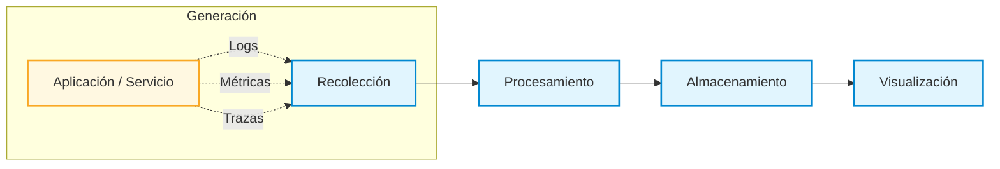

# Recurso Educativo para la Centralización de Logs y la Observabilidad en Sistemas Distribuidos

## 1. Introducción

La adopción creciente de arquitecturas basadas en sistemas distribuidos y microservicios ha transformado de manera significativa el desarrollo y la operación del software contemporáneo (Newman, 2015; Richardson, 2018; Bosch, 2016). Estas arquitecturas aportan beneficios claros en términos de escalabilidad, resiliencia y evolución independiente de los componentes; sin embargo, también introducen un aumento considerable en la complejidad asociada a su análisis y gestión.

En este escenario, comprender el comportamiento interno de los sistemas en ejecución se convierte en un reto central para la formación en ingeniería de sistemas y disciplinas afines. La **observabilidad** surge como un principio fundamental que permite abordar este reto, al posibilitar la inferencia del estado interno de un sistema a partir de las señales externas que este produce durante su operación (Majors, Fong-Jones & Miranda, 2022; Beyer et al., 2016; Sridharan, 2018).

El presente trabajo escrito tiene como propósito desarrollar, desde un enfoque académico y formativo, los fundamentos conceptuales de la observabilidad en sistemas distribuidos, con énfasis en la **centralización de logs** como uno de sus pilares principales. El documento se concibe como un recurso educativo orientado a facilitar el aprendizaje progresivo de estos conceptos, priorizando los principios y la arquitectura conceptual sobre el uso de herramientas o tecnologías específicas. Esta separación entre el marco teórico y las guías prácticas es una decisión metodológica deliberada: mantener el documento conceptual neutral en términos tecnológicos permite que los fundamentos presentados conserven validez con independencia de la evolución del ecosistema de herramientas, mientras que las guías prácticas ofrecen la experiencia concreta necesaria para anclar el aprendizaje en contextos reales (Kolb, 1984).

Las guías prácticas complementarias cubren un espectro tecnológico más amplio que el enunciado originalmente en la propuesta de trabajo. Esta ampliación es una decisión deliberada: el estado del arte de la observabilidad ha evolucionado de forma acelerada durante el período de desarrollo del recurso, incorporando estándares de protocolo unificado y plataformas de nueva generación que ofrecen un valor pedagógico significativo y mejoran la transferibilidad del conocimiento. Las guías adicionales se diseñaron con el mismo rigor y estructura que las originalmente propuestas, manteniendo coherencia con el marco conceptual presentado en este documento.

---

## 2. Justificación

La formación en ingeniería de sistemas enfrenta el desafío de preparar a los estudiantes para comprender y gestionar sistemas de software cada vez más complejos y distribuidos. Si bien los programas académicos suelen abordar con profundidad los aspectos relacionados con el diseño y la construcción de software, los elementos asociados a su operación, análisis y diagnóstico suelen recibir una atención limitada o fragmentada.

En particular, la observabilidad y la centralización de logs suelen introducirse desde enfoques predominantemente instrumentales, centrados en el uso de herramientas específicas. Esta aproximación dificulta la transferencia del conocimiento a contextos tecnológicos diversos y limita la comprensión de los principios conceptuales que subyacen a dichas prácticas (Cito et al., 2015).

En este contexto, se justifica el desarrollo de un trabajo académico que aborde la observabilidad y la centralización de logs desde una perspectiva teórica y estructurada, orientada al aprendizaje. Al priorizar un enfoque neutral en términos tecnológicos, el documento busca fortalecer el pensamiento sistémico, la capacidad analítica y la comprensión profunda de arquitecturas distribuidas, aportando así a la formación integral de los estudiantes.

---

## 3. Objetivos

### 3.1 Objetivo general

Desarrollar un marco conceptual que permita comprender la observabilidad en sistemas distribuidos, con énfasis en la centralización de logs, como fundamento para el análisis y la comprensión del comportamiento de sistemas de software complejos.

### 3.2 Objetivos específicos

- Analizar los fundamentos conceptuales de la observabilidad y su relevancia en arquitecturas distribuidas.
- Examinar el rol de los logs como fuente primaria de información sobre la ejecución de sistemas de software.
- Describir la centralización de logs como un mecanismo para reducir la complejidad cognitiva y operativa.
- Identificar beneficios y desafíos conceptuales asociados al diseño de soluciones de centralización de logs.

### 3.3 Resultados de aprendizaje esperados

Al finalizar el estudio de este documento, el estudiante será capaz de:

- **Definir** la observabilidad como principio de ingeniería y distinguirla de la monitorización tradicional en el contexto de sistemas distribuidos.
- **Explicar** por qué los logs constituyen una fuente primaria de información sobre el comportamiento interno de un sistema en ejecución.
- **Describir** la problemática de la dispersión de logs en arquitecturas de microservicios y argumentar la necesidad de su centralización.
- **Identificar** los componentes de la arquitectura conceptual de centralización de logs (recolección, procesamiento, almacenamiento y visualización) y el rol de cada uno dentro del flujo de información.
- **Analizar** los desafíos de diseño asociados a la estandarización semántica, el ciclo de vida de los datos y la protección de información sensible.
- **Relacionar** los conceptos teóricos desarrollados en este documento con las implementaciones prácticas abordadas en las guías complementarias.

---

## 4. Desarrollo de la temática

Esta sección desarrolla de manera progresiva los fundamentos conceptuales de la observabilidad y la centralización de logs en sistemas distribuidos. El recorrido inicia con la definición y alcance del concepto de observabilidad, avanza hacia el análisis del rol de los logs como fuente primaria de información y culmina con la presentación de una arquitectura conceptual que integra los distintos componentes involucrados. Esta progresión busca facilitar una comprensión gradual y coherente, orientada al aprendizaje y a la posterior aplicación práctica de los conceptos abordados.

### 4.1 Observabilidad en sistemas distribuidos

La observabilidad se define como la capacidad de inferir el estado interno de un sistema complejo a partir de las señales externas que este produce durante su ejecución (Majors, Fong-Jones & Miranda, 2022; Beyer et al., 2016; Sridharan, 2018). En sistemas distribuidos, esta capacidad resulta crítica debido a la concurrencia, la comunicación asincrónica y la distribución de responsabilidades entre múltiples componentes autónomos, factores que dificultan la identificación directa de causas y efectos (Usman et al., 2022).

Desde la ingeniería de software, la observabilidad se ha consolidado como un principio complementario a la monitorización tradicional. Mientras esta última se enfoca en indicadores previamente definidos, la observabilidad busca responder preguntas no anticipadas, permitiendo explorar el comportamiento del sistema cuando surgen fallos o degradaciones inesperadas (Turnbull, 2016). Este enfoque resulta particularmente relevante en arquitecturas de microservicios, donde los comportamientos emergentes no pueden ser previstos completamente en tiempo de diseño (Newman, 2015).

### 4.2 Logs como fuente primaria de información

Los logs constituyen registros textuales de eventos discretos que ocurren durante la ejecución de un sistema y representan una de las formas más expresivas de instrumentación del software (Turnbull, 2016). A diferencia de las métricas, que capturan valores agregados, y de las trazas, que describen recorridos de solicitudes, los logs preservan el contexto semántico de los eventos, facilitando la comprensión del *qué* y el *por qué* de una situación determinada.

Diversos estudios destacan que los logs no solo cumplen una función operativa, sino que actúan como artefactos de conocimiento que reflejan decisiones de diseño, supuestos implícitos y modelos mentales de los desarrolladores (Xu et al., 2009; Oliner, Ganapathi, & Xu, 2012; He et al., 2021). Desde una perspectiva formativa, esta característica permite a los estudiantes analizar evidencias reales de ejecución y vincular los conceptos teóricos de arquitectura y diseño con su manifestación práctica.

### 4.3 Problemática de la dispersión de logs

En sistemas distribuidos, cada componente genera sus propios registros de manera local, lo que conduce a una dispersión de la información que dificulta su análisis integral. Esta fragmentación incrementa la carga cognitiva requerida para el diagnóstico de fallos y limita la capacidad de correlacionar eventos entre servicios independientes (Cito et al., 2015).

La literatura señala que, a medida que aumenta el número de servicios y nodos, el análisis manual de logs locales se vuelve inviable, generando opacidad operativa y dependencia excesiva de conocimiento tácito (Oliner et al., 2012; Burns et al., 2016). Esta problemática refuerza la necesidad de enfoques sistemáticos para la gestión y análisis de registros en entornos distribuidos.

### 4.4 Centralización de logs

La centralización de logs surge como una estrategia para mitigar la dispersión de información mediante la recolección, consolidación y almacenamiento de los registros generados por los distintos componentes del sistema en un repositorio común (Turnbull, 2016; Majors, Fong-Jones & Miranda, 2022). Este enfoque facilita la consulta unificada, la correlación temporal y el análisis transversal de eventos.

Desde el punto de vista conceptual, la centralización de logs transforma un conjunto fragmentado de mensajes en una fuente coherente de conocimiento operativo, habilitando procesos de diagnóstico distribuido y análisis post-mortem de incidentes complejos (Beyer et al., 2016). Asimismo, permite reconstruir narrativas de ejecución que son fundamentales para comprender fallos en cascada y comportamientos no deterministas.

### 4.5 Beneficios conceptuales de la centralización de logs

La centralización de logs aporta beneficios que trascienden el ámbito técnico inmediato. Entre los más relevantes se encuentran:

- Mejora de la visibilidad global del sistema y de sus interacciones internas.
- Reducción de la complejidad cognitiva asociada al análisis de fallos distribuidos.
- Posibilidad de correlacionar eventos en función del tiempo y del contexto.
- Apoyo a procesos de aprendizaje, investigación formativa y análisis de casos reales.

Estos beneficios refuerzan el valor de la centralización de logs como herramienta conceptual para la formación en arquitectura de software y sistemas distribuidos (Bosch, 2016).

### 4.6 Desafíos y criterios conceptuales

El diseño de soluciones de centralización de logs implica enfrentar diversos desafíos técnicos y operativos (Kitchin, 2014; Beyer et al., 2016). Abordarlos adecuadamente requiere la adopción de criterios conceptuales sólidos:

- **Estandarización Semántica:** En arquitecturas heterogéneas, consolidar logs carece de valor si no comparten un esquema común. La adopción de estándares de esquema semántico ampliamente reconocidos en la industria —que definen convenciones uniformes para nombres de campos, tipos de datos y niveles de severidad— es fundamental para garantizar que los eventos de distintos servicios puedan correlacionarse correctamente (He, He, Chen et al., 2021), facilitando así la reconstrucción de flujos de ejecución distribuidos que atraviesan múltiples microservicios (Sigelman et al., 2010). Las guías prácticas complementarias ilustran la aplicación concreta de varios de estos estándares en diferentes ecosistemas tecnológicos.
- **Ciclo de Vida y Retención de Datos:** Dado el inmenso volumen de información operativa, los sistemas de centralización deben implementar políticas de retención, rotación y almacenamiento por niveles (*Hot/Cold storage*) para gestionar el impacto en la infraestructura sin perder capacidades de auditoría a largo plazo.
- **Seguridad y Privacidad (Sanitización):** Los logs suelen capturar inadvertidamente información sensible (contraseñas, tokens, datos de usuarios PII). Es imperativo que las arquitecturas incluyan mecanismos de censura o enmascaramiento de datos durante la fase de procesamiento antes de su indexación (Aghili, Li & Khomh, 2025).

Desde una perspectiva académica, el análisis de estos desafíos permite a los estudiantes desarrollar criterios transferibles a distintos contextos tecnológicos, fomentando una comprensión crítica de las decisiones de diseño y sus implicaciones operativas y éticas.

### 4.7 Arquitectura conceptual de las soluciones de centralización de logs

Aunque las implementaciones prácticas de la centralización de logs pueden variar ampliamente en función de las tecnologías empleadas, la literatura y la experiencia industrial coinciden en que dichas soluciones comparten una **arquitectura conceptual común**, compuesta por varios componentes claramente diferenciables (Turnbull, 2016; Newman, 2015).

Introducir esta arquitectura a nivel conceptual resulta pertinente desde el punto de vista formativo, ya que permite a los estudiantes comprender la lógica subyacente de las soluciones antes de enfrentarse a su implementación práctica, facilitando la transferencia de conocimiento entre distintos ecosistemas tecnológicos.

> **Nota sobre el alcance del diagrama:** Los sistemas distribuidos generan tres tipos de señales de observabilidad: **logs** (eventos discretos con contexto semántico), **métricas** (mediciones numéricas agregadas en el tiempo) y **trazas** (recorridos de solicitudes a través de múltiples servicios). La arquitectura conceptual de cuatro etapas —recolección, procesamiento, almacenamiento y visualización— aplica a las tres señales. Este documento centra su desarrollo en los **logs**, por ser la señal de mayor riqueza contextual y la más directamente vinculada a la comprensión del comportamiento interno del sistema (Majors, Fong-Jones & Miranda, 2022). Las guías prácticas complementarias amplían el tratamiento hacia métricas y trazas en los ecosistemas que las integran de forma nativa.

#### 4.7.1 Recolección de logs

El componente de **recolección de logs** es responsable de capturar los registros generados por aplicaciones, servicios y componentes de infraestructura. En términos conceptuales, este componente actúa como el punto de entrada del flujo de observabilidad y debe operar de manera desacoplada, de modo que la captura de eventos no interfiera con la ejecución normal del sistema.

Desde una perspectiva formativa, resulta relevante comprender que la recolección de logs involucra decisiones relacionadas con la ubicación de los agentes de captura, la frecuencia de recolección y el tipo de información registrada. Estas decisiones influyen directamente en la calidad, utilidad y confiabilidad de la observabilidad obtenida, y condicionan los análisis posteriores que pueden realizarse sobre los datos recolectados (Xu et al., 2009).

#### 4.7.2 Procesamiento y enriquecimiento de logs

El **procesamiento de logs** comprende el conjunto de actividades orientadas a transformar los registros crudos en información estructurada y significativa. Entre estas actividades se incluyen el filtrado de eventos irrelevantes, la normalización de formatos, el enriquecimiento semántico y la correlación básica de eventos.

Desde el punto de vista conceptual, este procesamiento permite reducir el ruido inherente a grandes volúmenes de datos operativos y preparar los logs para su almacenamiento y análisis posterior. En el ámbito educativo, este componente introduce a los estudiantes en la noción de que los datos generados por los sistemas requieren un tratamiento previo para convertirse en información útil y accionable (Oliner et al., 2012; He et al., 2017; Zhu et al., 2019).

#### 4.7.3 Almacenamiento y búsqueda

El **almacenamiento y motor de búsqueda** constituye el núcleo analítico de una solución de centralización de logs. Su función principal es conservar los registros de manera eficiente y habilitar mecanismos de consulta flexibles que faciliten el análisis exploratorio y el diagnóstico de incidentes.

A nivel conceptual, este componente introduce nociones fundamentales relacionadas con la indexación de datos, la gestión de la retención de información y la ejecución de consultas temporales. Estos aspectos resultan esenciales para comprender cómo se construye la visibilidad del sistema a lo largo del tiempo y cómo se posibilita el análisis retrospectivo de eventos (Kitchin, 2014; Kleppmann, 2017).

#### 4.7.4 Visualización y análisis

El componente de **visualización** tiene como propósito presentar la información contenida en los logs de manera comprensible para los usuarios humanos. Mediante representaciones gráficas, tablas y paneles, se facilita la identificación de patrones, tendencias y posibles anomalías en el comportamiento del sistema.

Desde una perspectiva formativa, la visualización cumple un rol clave al reducir la carga cognitiva asociada al análisis de grandes volúmenes de información y al permitir que los estudiantes desarrollen habilidades de interpretación y análisis de datos operativos. De este modo, se establece un vínculo directo entre los registros técnicos y los procesos de toma de decisiones informadas (Bosch, 2016).

#### 4.7.5 Integración conceptual de los componentes

Los componentes de recolección, procesamiento, almacenamiento y visualización no deben entenderse como elementos aislados, sino como partes interdependientes de un flujo continuo de información. Cada uno cumple una función específica dentro de la arquitectura, pero su valor emerge plenamente cuando se articulan de manera coherente.

Desde el punto de vista conceptual, esta integración permite comprender cómo los eventos generados durante la ejecución de un sistema se transforman progresivamente en información significativa para el análisis y la toma de decisiones. Para los estudiantes, esta visión integrada facilita el tránsito desde la comprensión teórica hacia la implementación práctica, al proporcionar un modelo mental claro que puede ser instanciado mediante distintas tecnologías en los ejercicios aplicados.

De este modo, la arquitectura conceptual presentada establece un puente entre los fundamentos teóricos desarrollados en este trabajo escrito y las actividades prácticas abordadas en los materiales complementarios, manteniendo la neutralidad tecnológica del documento.

---

## 5. Alcance del documento

Este trabajo se centra en el desarrollo teórico y conceptual de la centralización de logs como pilar de la observabilidad. Los aspectos prácticos, estudios de caso y guías de implementación se abordan en documentos complementarios, con el fin de preservar la neutralidad tecnológica y facilitar la reutilización del marco conceptual en distintos contextos académicos.

---

Este documento se limita intencionalmente a la **fundamentación teórica y conceptual** de la centralización de logs y su rol en la observabilidad. Las guías prácticas, laboratorios y escenarios de despliegue progresivo se desarrollan en documentos independientes, con el objetivo de:

- Mantener la neutralidad tecnológica del contenido central.
- Facilitar su reutilización en distintos cursos y programas académicos.
- Permitir la actualización incremental de las guías prácticas sin afectar el marco teórico.

---

## 6. Articulación con las actividades prácticas

Con el propósito de afianzar los fundamentos teóricos desarrollados a lo largo de este trabajo escrito, se han diseñado y documentado un conjunto de **guías prácticas** orientadas a la implementación de soluciones de centralización de logs mediante diferentes *stacks* tecnológicos. Estas guías permiten a los estudiantes materializar los conceptos de observabilidad y arquitectura conceptual estudiados, favoreciendo un aprendizaje activo y progresivo.

Las actividades prácticas no se conciben como ejercicios aislados ni como simples tutoriales de herramientas, sino como escenarios de aplicación que permiten reconocer, en contextos concretos, los componentes conceptuales analizados: recolección, procesamiento, almacenamiento, búsqueda y visualización de logs. De este modo, las guías prácticas refuerzan la transferencia del conocimiento teórico hacia entornos reales de operación, manteniendo la neutralidad tecnológica del marco conceptual presentado.

**Requisitos técnicos:** El despliegue de estos ecosistemas mediante contenedores requiere un uso intensivo de memoria. Se recomienda disponer de al menos **8 GB de RAM** libres y configurar adecuadamente los límites del sistema operativo (como `vm.max_map_count` en Linux/WSL) según se detalla en las guías, para evitar caídas en los servicios.

**Ruta de Aprendizaje Sugerida:**

Aunque las guías son independientes, se sugiere el siguiente orden de consumo para una progresión pedagógica óptima:

1. **[ELK Stack](guias/elk-guide.md):** Ideal para comenzar, siendo el ecosistema tradicional más extendido en la industria.
2. **[OLO Stack (OpenSearch)](guias/olo-guide.md):** Permite explorar la evolución natural y el *fork* Open Source de Elasticsearch.
3. **[Fluentd](guias/fluentd-guide.md):** Introduce enfoques alternativos y desacoplados para la recolección y ruteo de logs.
4. **[Promtail y Loki (Grafana)](guias/promtail-guide.md):** Aborda un modelo altamente eficiente basado en la indexación exclusiva de etiquetas, integrando las herramientas exactas mencionadas en la propuesta original.
5. **[GELF y Graylog](guias/gelf-graylog-guide.md):** Presenta formatos de transporte específicos y plataformas enfocadas exclusivamente en la gestión de logs.
6. **[OpenTelemetry](guias/otel-guide.md):** Presenta el estándar unificador actual y más interoperable para la observabilidad unificada.
7. **[Vector, Loki y Grafana](guias/vector-guide.md):** (*Estado del Arte*) Introduce el concepto de *Pipeline de Observabilidad* de alto rendimiento utilizando Rust para desplazar a recolectores pesados.
8. **[SigNoz (ClickHouse)](guias/signoz-guide.md):** (*Estado del Arte*) Plataforma "Todo en Uno" que utiliza OpenTelemetry nativamente y almacenamiento analítico columnar, representando la alternativa libre a plataformas comerciales.
9. **[Grafana Alloy](guias/alloy-guide.md):** (*Guía complementaria*) Migración de Promtail al sucesor oficial. Introduce el modelo de configuración orientado al flujo de datos (*dataflow*) con componentes explícitamente conectados.

---

## 7. Conclusiones

La observabilidad se consolida como un principio fundamental para la comprensión, análisis y gestión de sistemas distribuidos, al permitir inferir su comportamiento interno a partir de las señales externas generadas durante su ejecución. En arquitecturas basadas en microservicios, donde la complejidad operativa y los comportamientos emergentes son inherentes, este principio resulta indispensable para el diagnóstico, la toma de decisiones y la mejora continua de los sistemas (Majors, Fong-Jones & Miranda, 2022; Beyer et al., 2016).

Dentro de este marco, la centralización de logs se presenta como un pilar esencial de la observabilidad, no solo por su valor operativo, sino por su capacidad para transformar eventos dispersos en una fuente coherente de información y conocimiento. El desarrollo conceptual propuesto en este trabajo permite comprender la centralización de logs como un flujo integrado que articula componentes de recolección, procesamiento, almacenamiento y visualización, ofreciendo una visión sistémica del ciclo de vida de la información operativa.

Este enfoque arquitectónico y conceptual proporciona a los estudiantes un modelo mental transferible que facilita la comprensión de distintas implementaciones prácticas, independientemente de las tecnologías específicas empleadas. Al priorizar los principios y la arquitectura sobre las herramientas, el documento contribuye a una formación más sólida, crítica y adaptable a la evolución constante del ecosistema tecnológico.

En conjunto, el trabajo escrito ofrece una base teórica robusta y coherente que apoya los procesos formativos en ingeniería de sistemas y disciplinas afines, fortaleciendo la articulación entre fundamentos conceptuales y escenarios reales de operación, y sentando las bases para un aprendizaje significativo en torno a la observabilidad y la centralización de logs.

---

## 8. Referencias bibliográficas

Aghili, R., Li, H., & Khomh, F. (2025). Protecting privacy in software logs: What should be anonymized? *Proceedings of the ACM on Software Engineering, 2*(FSE). https://doi.org/10.1145/3715779

Beyer, B., Jones, C., Petoff, J., & Murphy, N. R. (2016). *Site reliability engineering: How Google runs production systems*. O’Reilly Media.

Bosch, J. (2016). Speed, data, and ecosystems: The future of software engineering. *IEEE Software, 33*(1), 82–88. https://doi.org/10.1109/MS.2016.14

Burns, B., Grant, B., Oppenheimer, D., Brewer, E., & Wilkes, J. (2016). Borg, Omega, and Kubernetes: Lessons learned from three container-management systems over a decade. *ACM Queue, 14*(1), 70–93. https://doi.org/10.1145/2898442.2898444

Cito, J., Leitner, P., Fritz, T., & Gall, H. C. (2015). The making of cloud applications: An empirical study on software development for the cloud. In *Proceedings of the 10th Joint Meeting on Foundations of Software Engineering* (pp. 393–403). Association for Computing Machinery. https://doi.org/10.1145/2786805.2786826

He, P., Zhu, J., Zheng, Z., & Lyu, M. R. (2017). Drain: An online log parsing approach with fixed depth tree. In *2017 IEEE International Conference on Web Services* (pp. 33–40). IEEE. https://doi.org/10.1109/ICWS.2017.13

He, S., He, P., Chen, Z., Yang, T., Su, Y., & Lyu, M. R. (2021). A survey on automated log analysis for reliability engineering. *ACM Computing Surveys, 54*(6), Article 130, 1–37. https://doi.org/10.1145/3460345

Kitchin, R. (2014). *The data revolution: Big data, open data, data infrastructures and their consequences*. Sage Publications.

Kolb, D. A. (1984). *Experiential learning: Experience as the source of learning and development*. Prentice-Hall.

Kleppmann, M. (2017). *Designing data-intensive applications: The big ideas behind reliable, scalable, and maintainable systems*. O’Reilly Media.

Majors, C., Fong-Jones, L., & Miranda, G. (2022). *Observability engineering: Achieving production excellence*. O’Reilly Media.

Newman, S. (2015). *Building microservices: Designing fine-grained systems*. O’Reilly Media.

Oliner, A. J., Ganapathi, A., & Xu, W. (2012). Advances and challenges in log analysis. *Communications of the ACM, 55*(2), 55–61. https://doi.org/10.1145/2076450.2076466

Richardson, C. (2018). *Microservices patterns: With examples in Java*. Manning Publications.

Sigelman, B. H., Barroso, L. A., Burrows, M., Stephenson, P., Plakal, M., Beaver, D., Jaspan, S., & Shanbhag, C. (2010). *Dapper, a large-scale distributed systems tracing infrastructure* (Technical Report dapper-2010-1). Google.

Sridharan, C. (2018). *Distributed systems observability: A guide to building robust systems*. O’Reilly Media.

Turnbull, J. (2016). *The art of monitoring*. Turnbull Press.

Usman, M., Ferlin, S., Brunstrom, A., & Taheri, J. (2022). A survey on observability of distributed edge & container-based microservices. *IEEE Access, 10*, 86904–86919. https://doi.org/10.1109/ACCESS.2022.3193102

Xu, W., Huang, L., Fox, A., Patterson, D., & Jordan, M. I. (2009). Detecting large-scale system problems by mining console logs. In *Proceedings of the ACM SIGOPS 22nd Symposium on Operating Systems Principles* (pp. 117–132). Association for Computing Machinery. https://doi.org/10.1145/1629575.1629587

Zhu, J., He, S., Liu, J., He, P., Xie, Q., Zheng, Z., & Lyu, M. R. (2019). Tools and benchmarks for automated log parsing. In *Proceedings of the 41st International Conference on Software Engineering: Software Engineering in Practice* (pp. 121–130). IEEE. https://doi.org/10.1109/ICSE-SEIP.2019.00021

