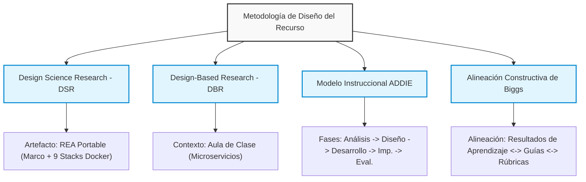
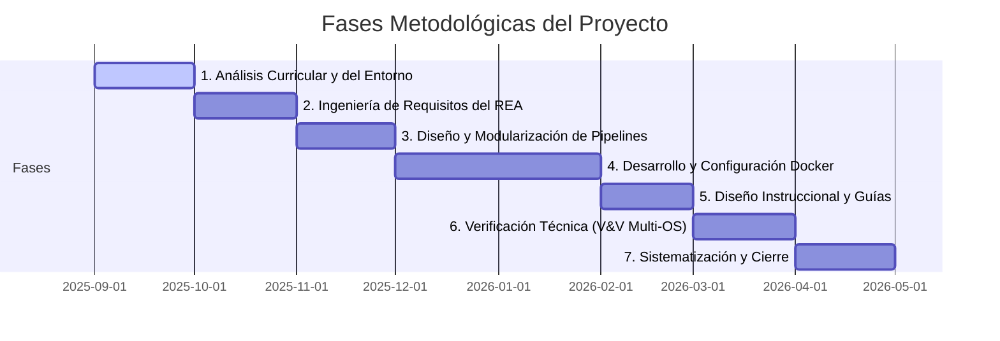
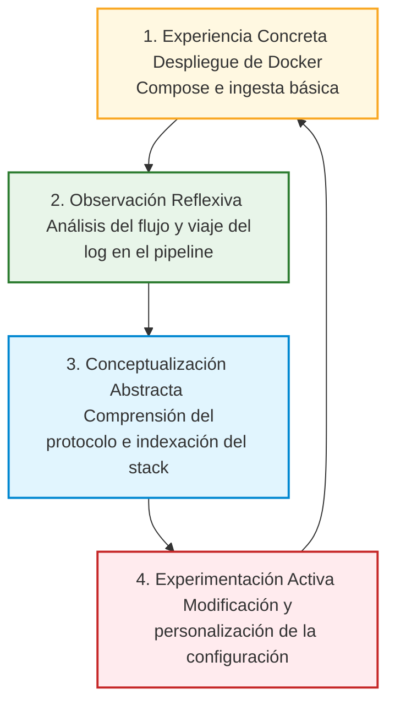
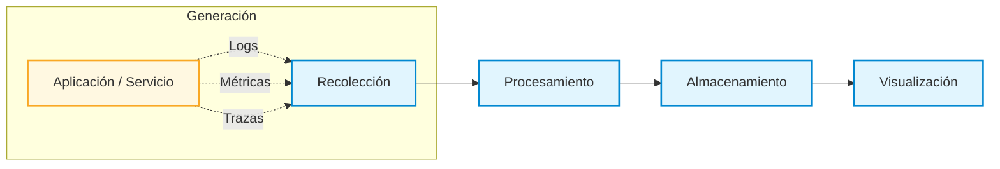

# Recurso Educativo para el Despliegue de Ecosistemas de Centralización de Logs Mediante Docker

**Autores**  
- Ph.D. Christian Andrés Candela Uribe — Profesor Asociado ([ORCID](https://orcid.org/0000-0002-3961-1840))  
- M.Sc. Paola Andrea Acero Franco — Profesor Asociado ([ORCID](https://orcid.org/0009-0005-6538-5030))  
- Ph.D. Luis Eduardo Sepúlveda Rodríguez — Profesor Asociado ([ORCID](https://orcid.org/0000-0003-2446-0602))  

**Universidad del Quindío** — Programa de Ingeniería de Sistemas y Computación  
**Asignatura asociada:** Arquitectura Orientada a Microservicios  
**Versión:** 1.0.0 | **Fecha:** mayo de 2026  
[](https://creativecommons.org/licenses/by-sa/4.0/deed.es) [](https://doi.org/10.5281/zenodo.20187576)

> Este recurso educativo abierto consta de: (a) el presente marco conceptual, (b) una guía de estudio con preguntas de comprensión y articulación teoría–práctica ([`guia_estudio.md`](./guia_estudio.md)), (c) una guía para docentes con planificación sugerida y rúbricas ([`guia_docente.md`](./guia_docente.md)), y (d) nueve guías prácticas reproducibles en el directorio [`guias/`](./guias/) con sus respectivas soluciones en [`soluciones/`](./soluciones/).

## 1. Introducción

La adopción creciente de arquitecturas basadas en sistemas distribuidos y microservicios ha transformado de manera significativa el desarrollo y la operación del software contemporáneo (Newman, 2015; Richardson, 2018; Bosch, 2016). Estas arquitecturas aportan beneficios claros en términos de escalabilidad, resiliencia y evolución independiente de los componentes; sin embargo, también introducen un aumento considerable en la complejidad asociada a su análisis y gestión.

En este escenario, comprender el comportamiento interno de los sistemas en ejecución se convierte en un reto central para la formación en ingeniería de sistemas y disciplinas afines. La **observabilidad** surge como un principio fundamental que permite abordar este reto, al posibilitar la inferencia del estado interno de un sistema a partir de las señales externas que este produce durante su operación (Majors, Fong-Jones & Miranda, 2022; Beyer et al., 2016; Sridharan, 2018).

El presente trabajo escrito tiene como propósito desarrollar, desde un enfoque académico y formativo, los fundamentos conceptuales de la observabilidad en sistemas distribuidos, con énfasis en la **centralización de logs** como uno de sus pilares principales. El documento se concibe como un recurso educativo orientado a facilitar el aprendizaje progresivo de estos conceptos, priorizando los principios y la arquitectura conceptual sobre el uso de herramientas o tecnologías específicas. Esta separación entre el marco teórico y las guías prácticas es una decisión metodológica deliberada: mantener el documento conceptual neutral en términos tecnológicos permite que los fundamentos presentados conserven validez con independencia de la evolución del ecosistema de herramientas, mientras que las guías prácticas ofrecen la experiencia concreta necesaria para anclar el aprendizaje en contextos reales (Kolb, 1984).

Las guías prácticas complementarias cubren un espectro tecnológico más amplio que el enunciado originalmente en la propuesta de trabajo. Esta ampliación es una decisión consciente: el estado del arte de la observabilidad ha evolucionado de forma acelerada durante el período de desarrollo del recurso, incorporando estándares de protocolo unificado y plataformas de nueva generación que ofrecen un valor pedagógico significativo y mejoran la transferibilidad del conocimiento. Las guías adicionales se diseñaron con el mismo rigor y estructura que las originalmente propuestas, manteniendo coherencia con el marco conceptual presentado en este documento.

## 2. Justificación

La formación en ingeniería de sistemas enfrenta el desafío de preparar a los estudiantes para comprender y gestionar sistemas de software cada vez más complejos y distribuidos. Si bien los programas académicos suelen abordar con profundidad los aspectos relacionados con el diseño y la construcción de software, los elementos asociados a su operación, análisis y diagnóstico suelen recibir una atención limitada o fragmentada.

En particular, la observabilidad y la centralización de logs suelen introducirse desde enfoques predominantemente instrumentales, centrados en el uso de herramientas específicas. Esta aproximación dificulta la transferencia del conocimiento a contextos tecnológicos diversos y limita la comprensión de los principios conceptuales que subyacen a dichas prácticas (Cito et al., 2015).

En este contexto, se justifica el desarrollo de un trabajo académico que aborde la observabilidad y la centralización de logs desde una perspectiva teórica y estructurada, orientada al aprendizaje. Al priorizar un enfoque neutral en términos tecnológicos, el documento busca fortalecer el pensamiento sistémico, la capacidad analítica y la comprensión profunda de arquitecturas distribuidas, aportando así a la formación integral de los estudiantes.

## 3. Objetivos

### 3.1 Objetivo general

Desarrollar un marco conceptual que permita comprender la observabilidad en sistemas distribuidos, con énfasis en la centralización de logs, como fundamento para el análisis y la comprensión del comportamiento de sistemas de software complejos.

### 3.2 Objetivos específicos

- Analizar los fundamentos conceptuales de la observabilidad y su relevancia en arquitecturas distribuidas.
- Examinar el rol de los logs como fuente primaria de información sobre la ejecución de sistemas de software.
- Describir la centralización de logs como un mecanismo para reducir la complejidad cognitiva y operativa.
- Identificar beneficios y desafíos conceptuales asociados al diseño de soluciones de centralización de logs.

### 3.3 Resultados de aprendizaje esperados

Al finalizar el estudio de este documento, el estudiante será capaz de:

- **Definir** la observabilidad como principio de ingeniería y distinguirla de la monitorización tradicional en el contexto de sistemas distribuidos.
- **Explicar** por qué los logs constituyen una fuente primaria de información sobre el comportamiento interno de un sistema en ejecución.
- **Describir** la problemática de la dispersión de logs en arquitecturas de microservicios y argumentar la necesidad de su centralización.
- **Identificar** los componentes de la arquitectura conceptual de centralización de logs (recolección, procesamiento, almacenamiento y visualización) y el rol de cada uno dentro del flujo de información.
- **Analizar** los desafíos de diseño asociados a la estandarización semántica, el ciclo de vida de los datos y la protección de información sensible.
- **Relacionar** los conceptos teóricos desarrollados en este documento con las implementaciones prácticas abordadas en las guías complementarias.

## 4. Metodología de Construcción del Recurso Educativo y Trazabilidad con la Propuesta

La construcción de este recurso educativo se concibe como un proceso aplicado de diseño, desarrollo, verificación y validación de un **artefacto instruccional y tecnológico**. Este trabajo tiene como propósito diseñar un **Recurso Educativo Abierto (REA) portable y modular**.

Por consiguiente, la metodología se enfoca en la articulación sistémica entre directrices curriculares de la Ingeniería de Sistemas, estándares contemporáneos de observabilidad industrial (DevOps/SRE) y la viabilidad instruccional en entornos heterogéneos mediante contenedores Docker.

### 4.1. Enfoque metodológico adoptado

El desarrollo metodológico integra cuatro referentes teóricos de la educación en ingeniería y el diseño de sistemas:



1. **Design Science Research (DSR):** Permite tratar el recurso educativo (compuesto por el marco conceptual, las 9 guías en markdown, las plantillas de configuración y la guía docente) como un **artefacto diseñado** para resolver un problema práctico: la complejidad cognitiva que enfrentan los estudiantes al comprender arquitecturas de observabilidad distribuidas y heterogéneas (Hevner et al., 2004; Peffers et al., 2007). La evaluación del artefacto se realiza bajo criterios de utilidad pedagógica, claridad procedimental y reproducibilidad multiplataforma.
2. **Design-Based Research (DBR):** Aporta los principios de diseño orientado a contextos reales de aprendizaje y de refinamiento iterativo que guían la construcción del recurso con miras a su puesta en práctica en el aula de la asignatura *Arquitectura Orientada a Microservicios* (Design-Based Research Collective, 2003; McKenney & Reeves, 2018). La validación empírica con estudiantes (análisis de las curvas de aprendizaje y depuración del código Docker ante la heterogeneidad de sus equipos personales) se plantea como fase de **trabajo futuro**, dado que esta versión corresponde a la primera publicación del recurso.
3. **Modelo ADDIE:** Estructura de forma sistemática el ciclo de vida instruccional del recurso a través de sus fases de Análisis (de necesidades curriculares y de los entornos de ejecución del estudiante), Diseño (de los RAE y la estructura de las guías), Desarrollo (configuración de los entornos Docker Compose y mockups de microservicios), Implementación (preparación del despliegue local para su ejecución por parte de los estudiantes) y Evaluación (diseño de rúbricas cualitativas y cuantitativas) (Branch, 2009).
4. **Alineación Constructiva (Biggs):** Garantiza que no haya desconexión entre los objetivos de aprendizaje de la asignatura, las actividades técnicas requeridas en las guías y los criterios e instrumentos de evaluación declarados en la guía docente (Biggs & Tang, 2011).

### 4.2. Naturaleza del trabajo y tipo de producto esperado

El trabajo se clasifica como un **desarrollo académico aplicado con orientación instruccional y tecnológica**. El producto final esperado es un **Recurso Educativo Abierto (REA)** compuesto por:  

1. Un marco conceptual neutro respecto a las herramientas.
2. Una arquitectura conceptual general del flujo de logs (recolección, procesamiento, almacenamiento y visualización).
3. Nueve (9) guías prácticas e independientes que materializan dicha arquitectura mediante diferentes combinaciones tecnológicas (*stacks*).
4. Una guía didáctica para docentes y una guía de estudio para estudiantes.

El valor del producto radica en su **portabilidad, modularidad y transferibilidad**, permitiendo que cualquier docente o estudiante de Ingeniería de Sistemas pueda replicar los ecosistemas con el único requisito de contar con un motor de contenedores Docker.

### 4.3. Principios metodológicos

El diseño del recurso se sustenta en los siguientes principios metodológicos:  

* **Interoperabilidad Curricular y Adaptabilidad (Filosofía REA):** Los contenidos didácticos y stacks prácticos deben estar diseñados para ser independientes de los programas de curso de una institución específica. Se estructuran alineándose con las directrices de currículo globales de computación (ACM/IEEE) y se suministran **rutas de aprendizaje flexibles**, facilitando que el recurso pueda ser extrapolado y adoptado en diferentes materias del área de Infraestructura y Desarrollo de TI (ej. Sistemas Distribuidos, DevOps, Arquitectura de Software).
* **Reproducibilidad multiplataforma:** Los procedimientos técnicos y los contenedores deben estar diseñados para ser agnósticos respecto al sistema operativo del host local (compatibles con Windows/WSL2, macOS y GNU/Linux).
* **Transparencia y visibilidad de recursos (Capacity Planning):** El recurso exige la **visibilidad, parametrización y dimensionamiento explícito** de los requerimientos de CPU, memoria RAM y dependencias de software de cada una de las prácticas. Esto permite que el REA pueda ser extrapolado y dimensionado de forma adaptativa a contextos educativos con diferentes restricciones de recursos.
* **Independencia instrumental (Neutralidad):** Las guías prácticas deben funcionar de forma modular, permitiendo al estudiante comprender que las herramientas tecnológicas cambian de un stack a otro, pero las etapas funcionales del pipeline permanecen constantes.
* **Estructura pedagógica experiencial:** Cada guía debe estructurarse internamente bajo el ciclo de aprendizaje de Kolb (Experiencia, Observación, Conceptualización y Experimentación).

### 4.4. Fases del desarrollo metodológico

Para la consecución de los objetivos propuestos, el proyecto se organizó en siete fases sistemáticas. Cada fase produce insumos o evidencias que estructuran el recurso educativo final. 



A continuación, la Tabla 1 detalla las actividades principales, los productos esperados y los criterios de aceptación de cada una de las fases a la luz de los requerimientos de portabilidad y adaptabilidad que definen a un Recurso Educativo Abierto (REA):

**Tabla 1.** Fases metodológicas, productos esperados y criterios de aceptación.

| Fase | Actividades Principales | Producto Esperado | Criterio de Aceptación (Calidad/REA) |
| :--- | :--- | :--- | :--- |
| **1. Análisis Curricular y Tecnológico** | * Revisión de literatura sobre observabilidad, DevOps y prácticas instruccionales de SRE.<br>* Análisis del microcurrículo de *Arquitectura Orientada a Microservicios* y las directrices globales ACM/IEEE (CS2023). | Marco conceptual inicial y justificación pedagógica. | El marco conceptual fundamenta la necesidad de la observabilidad, es neutro respecto a herramientas y se alinea con competencias internacionales. |
| **2. Especificación de Requisitos y Entornos** | * Análisis de la heterogeneidad de entornos locales de ejecución y definición de variables de portabilidad multiplataforma.<br>* Especificación de requisitos funcionales, pedagógicos de interoperabilidad y directrices de dimensionamiento de recursos (CPU/RAM). | Catálogo estructurado de requisitos del REA y especificaciones de dimensionamiento técnico. | Los requisitos detallan de forma medible la portabilidad multi-OS y establecen la transparencia técnica (visibilidad y parametrización de límites de CPU/RAM) como directriz obligatoria para todas las guías. |
| **3. Diseño de Pipelines** | * Modelado conceptual de los flujos de logs de 4 etapas (Recolección, Procesamiento, Almacenamiento, Visualización).<br>* Planificación y estructuración lógica de los 9 escenarios prácticos. | Arquitectura conceptual y lógica de observabilidad. | El diseño demuestra la independencia de herramientas y define flujos de datos abstractos, modulares y reutilizables. |
| **4. Desarrollo de los Ecosistemas Docker** | * Escritura de archivos `docker-compose.yml` autocontenidos y parametrizados.<br>* Configuración de colectores, motores de almacenamiento e indexación, y paneles de visualización. | Código y scripts de configuración funcionales en el repositorio. | Los entornos Docker Compose corren de forma modular y portable, con límites de recursos (`mem_limit`) ajustables de manera sencilla. |
| **5. Diseño Instruccional del REA** | * Redacción de las guías didácticas prácticas, docente y de estudio.<br>* Formulación de Resultados de Aprendizaje Esperados (RAE), preguntas basadas en Kolb y rúbricas. | Guías académicas complementarias e instrumentos de evaluación. | Cada práctica contiene un RAE observable, un fundamento teórico neutral, procedimiento reproducible y rúbricas cualitativas homogéneas. |
| **6. Verificación Técnica (V&V Multi-OS)** | * Despliegue y pruebas de portabilidad (verificación ejecutada sobre macOS Apple Silicon ARM; Windows 11/WSL2 y Ubuntu Linux como objetivos de verificación en curso).<br>* Monitoreo de consumos con `docker stats`. | Matriz de pruebas y reportes de portabilidad del entorno. | Cada stack se despliega en un host limpio e indica sus prerrequisitos técnicos de forma transparente; la cobertura multi-OS completa se documenta como verificación en curso. |
| **7. Sistematización y Licenciamiento** | * Empaquetado final de códigos y documentación base.<br>* Configuración de licencia Creative Commons (CC BY-SA 4.0).<br>* Publicación e indexación del recurso en Zenodo (generación de DOI). | Repositorio definitivo publicado, archivo CITATION.cff y DOI. | El recurso cuenta con un DOI válido, licencia abierta compatible con REA y directrices claras de citación estructurada para adopción externa. |

### 4.5. Especificación de requisitos del recurso educativo

El catálogo de requisitos del REA se estructura a partir de criterios técnicos e instruccionales, aplicables en cualquier equipo personal con un motor de contenedores:

**Tabla 2.** Clasificación de requisitos del recurso educativo abierto.

| Categoría de Requisito | Origen del Requisito | Especificación Aplicada | Criterio de Verificación / Evidencia |
| :--- | :--- | :--- | :--- |
| **Requisitos Funcionales** | Demandas de la temática de Microservicios. | El ecosistema Docker debe aprovisionar un flujo completo donde una aplicación mock genera logs JSON, un colector los procesa estructuradamente y los ingesta en un indexador para ser consultados en un dashboard. | Visualización de los logs formateados en el panel del stack correspondiente, evidenciada en la sección de capturas de las soluciones. |
| **Requisitos No Funcionales** | Criterios de calidad, modularidad y portabilidad de software. | Las configuraciones e imágenes de los contenedores Docker deben ser portables y construidas de forma que no tengan dependencias locales del sistema de desarrollo de los autores. | Ejecución exitosa de `docker compose up` en un entorno host limpio y sin preconfiguraciones del sistema de archivos. |
| **Requisitos Pedagógicos (Interoperabilidad)** | Filosofía REA y adaptabilidad curricular. | El diseño didáctico debe alinearse con estándares de computación internacionales (ACM/IEEE) y estructurarse mediante **Rutas de Aprendizaje Modulares** e instrumentos de evaluación genéricos. Esto facilita que cualquier docente de asignaturas afines (DevOps, Redes, Sistemas Distribuidos, Arquitectura) pueda reusar y adoptar el recurso de forma modular en sus propios LMS (Moodle, Canvas, Classroom). | Estructuración homogénea de la Guía del Docente (`guia_docente.md`) con matrices de mapeo temático multiplan, rúbricas de evaluación genéricas y planeaciones adaptativas según el enfoque del curso. |
| **Restricción de Entorno (Transparencia)** | Filosofía REA y adaptabilidad de contextos educativos. | El recurso didáctico debe declarar de forma explícita los requisitos mínimos y recomendados de hardware (RAM/CPU) y software de cada práctica, y parametrizar los límites de memoria de Docker (`mem_limit`) para permitir su escalado o atenuación adaptativa. | Sección estructurada "Dimensionamiento y Prerrequisitos de Recursos" al inicio de cada una de las 9 guías prácticas en el repositorio. |

### 4.6. Diseño instruccional y pedagógico de las guías prácticas

El diseño de las prácticas académicas asume el computador personal del estudiante como laboratorio de experimentación activa, reproducible en cualquier equipo que disponga de un motor de contenedores Docker. Cada una de las 9 guías prácticas se diseña bajo la estructura del **Ciclo de Aprendizaje Experiencial de Kolb**, garantizando que el paso a paso sea una oportunidad de reflexión teórica:



Para asegurar la coherencia sistémica, cada guía didáctica en el repositorio cumple con la siguiente estructura formal:

1. **Resultados de Aprendizaje Esperados (RAE):** Definición exacta de las habilidades conceptuales y operativas que el estudiante adquirirá.
2. **Dimensionamiento y Prerrequisitos de Recursos:** Estimación explícita del consumo de memoria RAM y CPU del stack, advertencias de configuración del host (ej. límites del sistema operativo) y parametrización de los límites de memoria de los contenedores (`mem_limit` vía variables de entorno `.env`).
3. **Diagrama del Pipeline Lógico:** Ilustración de la arquitectura de la guía en función de las 4 etapas del ciclo de logs.
4. **Procedimiento Técnico Paso a Paso:** Comandos y configuraciones limpias, reproducibles y ordenadas.
5. **Cuestionario de Análisis Crítico:** Preguntas diseñadas para la conceptualización abstracta y el diagnóstico reflexivo de fallos.

Los **instrumentos de evaluación** (entregables exigibles y rúbrica analítica de niveles de desempeño) se proveen de forma **homogénea y centralizada** en la guía docente (`guia_docente.md` §6), aplicables de manera uniforme a cualquiera de las nueve guías. Esta centralización es una decisión deliberada de diseño REA: garantiza criterios de evaluación consistentes entre stacks, evita la duplicación de rúbricas y facilita que el docente adopte y adapte un único conjunto de instrumentos.

### 4.7. Marco de Verificación y Validación (V&V)

El marco de verificación y validación del recurso se centra en dos dimensiones propias de un artefacto educativo abierto: la **calidad de la portabilidad** (reproducibilidad multiplataforma) y la **claridad didáctica**:

* **Verificación del Artefacto (Calidad Técnica de los Entornos):**
  * *Verificación de portabilidad multiplataforma:* Los archivos de Docker Compose se diseñaron para ser portables sobre los sistemas operativos y arquitecturas de uso común en los equipos de los estudiantes:
    1. **Windows 11 Home/Pro** sobre WSL2 (arquitectura x86).
    2. **macOS** Sequoia/Sonoma (Apple Silicon ARM y x86 Intel).
    3. **Ubuntu Linux 22.04 LTS** (arquitectura x86).

    La verificación de despliegue se ejecutó sobre **macOS (Apple Silicon ARM)**, entorno disponible para los autores; la verificación sistemática sobre Windows 11/WSL2 y Ubuntu Linux, así como sobre la matriz completa de sistemas operativos y arquitecturas, se contempla como verificación en curso y trabajo futuro.
  * *Verificación de Parametrización:* Comprobación de que las guías incluyan la parametrización de recursos necesaria para que los límites del contenedor puedan modificarse editando archivos de variables de entorno `.env` o directivas en el archivo Compose.
  * *Validación de Imágenes Libres:* Empleo exclusivo de imágenes oficiales de Docker Hub o de registros de código abierto para evitar licenciamientos privativos.
* **Validación del Artefacto (Eficacia Didáctica y Curricular):**
  * *Validación de Coherencia Pedagógica:* Revisión de que las tareas solicitadas permitan alcanzar y evaluar empíricamente los Resultados de Aprendizaje Esperados (RAE) de la asignatura *Arquitectura Orientada a Microservicios*.
  * *Evaluación Editorial y Estructura Docente:* Revisión de la portabilidad e inteligibilidad de la guía docente (`guia_docente.md`) para asegurar que el recurso pueda ser fácilmente reutilizado por otros docentes del programa de Ingeniería de Sistemas.

**Delimitación del alcance evaluativo.** Los **Resultados de Aprendizaje Esperados (RAE)** declarados en el recurso son objetivos de diseño instruccional, no mediciones empíricas. Los objetivos comprometidos en la propuesta aprobada se circunscriben al **diseño, desarrollo y verificación técnica** del REA (fundamentación teórica, guías prácticas y entornos reproducibles); la **medición del impacto pedagógico** (la evaluación empírica de los resultados de aprendizaje al aplicar el recurso con estudiantes) excede dichos objetivos y se proyecta como una **fase posterior** de validación en aula —analítica de uso, encuestas de percepción y ajuste iterativo conforme a los principios de la investigación basada en diseño (DBR)—, dado que esta versión corresponde a la primera publicación del recurso.

#### 4.7.1. Prueba de humo estandarizada

Cada una de las nueve soluciones incorpora un script de prueba de humo (`smoke_test.sh`) que automatiza la verificación de extremo a extremo del pipeline: levanta el ecosistema, espera a que la aplicación productora esté lista, emite un log de prueba con un marcador único y confirma su registro en el motor de almacenamiento correspondiente. Este procedimiento de prueba materializa empíricamente el principio de **independencia instrumental**: la fase de **generación** del log es idéntica en los nueve stacks, mientras que solo la **verificación del registro** varía según la herramienta. La siguiente tabla separa ambas partes:

**Tabla 3.** Estandarización de la prueba de humo: fase de generación (invariante) frente a verificación del registro (específica de la herramienta).

| Fase del procedimiento | ¿Estándar entre stacks? | Detalle |
| :--- | :--- | :--- |
| Despliegue y ciclo de vida | Invariante | `docker compose up -d --build` → ejecución → `down -v` con limpieza ante error (`trap`). |
| Sonda de disponibilidad del productor | Invariante | `POST /logs` con `{"level": "INFO", "message": "PING"}`, reintentos hasta obtener HTTP 200. |
| Estabilización de la ingesta | Invariante | Espera fija previa al envío del mensaje de prueba. |
| **Emisión del log de prueba** | **Invariante** | `POST /logs` con el esquema `{"level": "WARN", "message": "<marcador único>"}` hacia la misma interfaz del productor. |
| Verificación del registro | Específica de la herramienta | Consulta `_search` en Elasticsearch/OpenSearch, `query_range` (LogQL) en Loki o SQL en ClickHouse, según el motor. |

Las únicas variaciones en la fase de generación responden a restricciones técnicas justificadas: el puerto del productor cambia en el stack que coexiste con servicios que ocupan el puerto por defecto, y dos stacks añaden pasos previos de aprovisionamiento (creación del *input* de ingesta o clonado del repositorio base). Que la interfaz de emisión de logs permanezca constante mientras el conjunto de herramientas cambia por completo constituye evidencia operativa directa de la tesis central del recurso: **las etapas funcionales del pipeline son invariantes; las tecnologías que las implementan, no**.

### 4.8. Matriz de trazabilidad con la propuesta aprobada

La siguiente matriz detalla de forma explícita cómo cada uno de los tres objetivos específicos (OE) comprometidos en la propuesta oficial aprobada de ascenso a Titular se materializa formalmente en los capítulos, guías, configuraciones y criterios del presente recurso educativo:

**Tabla 4.** Trazabilidad entre los objetivos específicos de la propuesta aprobada y los componentes del recurso.

| Objetivo Específico (OE) de la Propuesta Aprobada | Componentes y Archivos de Desarrollo | Evidencias y Artefactos Técnicos y Didácticos | Criterio y Métrica de Cumplimiento del Objetivo |
| :--- | :--- | :--- | :--- |
| **OE1:** Establecer los elementos teóricos relacionados con los logs centralizados en microservicios. | * Capítulos 1, 2, 3 y 4 del libro base (`readme.md`).<br>* Cuestionario de estudio conceptual (`guia_estudio.md`). | * Marco conceptual de la observabilidad (recolección, procesamiento, almacenamiento, visualización).<br>* Bibliografía de referencia especializada indexada. | El marco conceptual es agnóstico a las herramientas, fundamenta científicamente la observabilidad en sistemas distribuidos y analiza las implicaciones del esquema semántico y la privacidad. |
| **OE2:** Elaborar guías prácticas para el despliegue progresivo de soluciones para centralización de logs utilizando Docker. | * Carpeta de guías didácticas (`guias/` de la 1 a la 9).<br>* Rúbricas y planeación sugerida (`guia_docente.md`). | * 9 Guías académicas estructuradas bajo el modelo instruccional de Kolb.<br>* Rúbrica analítica homogénea y entregables exigibles definidos en la guía docente, aplicables a las 9 guías. | Se diseñan 9 guías instruccionales que cubren desde los stacks tradicionales hasta soluciones en el estado del arte, ordenadas por complejidad progresiva. |
| **OE3:** Implementar cada guía en entornos funcionales y reproducibles para los estudiantes. | * Carpeta de configuraciones y entornos (`soluciones/` de la 1 a la 9).<br>* Repositorio de código con archivos `docker-compose.yml` y configs. | * Archivos YAML de Docker Compose funcionales.<br>* Archivos de configuración de colectores e indexadores.<br>* Aplicaciones mocks generadoras de logs.<br>* Logs e historiales de comandos. | Las 9 soluciones y contenedores de observabilidad son funcionales, portables y reproducibles, estructuradas de forma parametrizada y con guías de dimensionamiento técnico. |

## 5. Desarrollo de la temática

Esta sección desarrolla de manera progresiva los fundamentos conceptuales de la observabilidad y la centralización de logs en sistemas distribuidos. El recorrido inicia con la definición y alcance del concepto de observabilidad, avanza hacia el análisis del rol de los logs como fuente primaria de información y culmina con la presentación de una arquitectura conceptual que integra los distintos componentes involucrados. Esta progresión busca facilitar una comprensión gradual y coherente, orientada al aprendizaje y a la posterior aplicación práctica de los conceptos abordados.

### 5.1 Observabilidad en sistemas distribuidos

La observabilidad se define como la capacidad de inferir el estado interno de un sistema complejo a partir de las señales externas que este produce durante su ejecución (Majors, Fong-Jones & Miranda, 2022; Beyer et al., 2016; Sridharan, 2018). En sistemas distribuidos, esta capacidad resulta crítica debido a la concurrencia, la comunicación asincrónica y la distribución de responsabilidades entre múltiples componentes autónomos, factores que dificultan la identificación directa de causas y efectos (Usman et al., 2022).

Desde la ingeniería de software, la observabilidad se ha consolidado como un principio complementario a la monitorización tradicional. Mientras esta última se enfoca en indicadores previamente definidos, la observabilidad busca responder preguntas no anticipadas, permitiendo explorar el comportamiento del sistema cuando surgen fallos o degradaciones inesperadas (Turnbull, 2016). Este enfoque resulta particularmente relevante en arquitecturas de microservicios, donde los comportamientos emergentes no pueden ser previstos completamente en tiempo de diseño (Newman, 2015).

Conviene precisar que el término *observabilidad* no se originó en la ingeniería de software, sino en la teoría de control, donde Kalman (1960) lo definió formalmente como la propiedad que permite reconstruir el estado interno de un sistema dinámico a partir del conocimiento de sus salidas externas. Esta raíz conceptual resulta esclarecedora: un sistema es observable no por la cantidad de datos que emite, sino por la posibilidad de inferir su estado interno a partir de ellos. Trasladada al software, la observabilidad no se reduce, por tanto, a "generar abundantes registros", sino a disponer de señales suficientes y bien estructuradas para responder preguntas sobre el comportamiento del sistema.

En la práctica, la observabilidad de un sistema de software se construye sobre tres tipos de señales complementarias, conocidas como los **tres pilares de la observabilidad** (Sridharan, 2018; Majors, Fong-Jones & Miranda, 2022):

| Señal | Naturaleza | Pregunta que ayuda a responder | Ejemplo conceptual |
|---|---|---|---|
| **Logs** | Registros textuales de eventos discretos | ¿Qué ocurrió exactamente y por qué? | `ERROR pago rechazado: saldo insuficiente, usuario=4827` |
| **Métricas** | Valores numéricos agregados en el tiempo | ¿Cuánto, con qué frecuencia, con qué tendencia? | `solicitudes_por_segundo = 1450` |
| **Trazas** | Recorrido de una solicitud a través de varios servicios | ¿Por dónde pasó la solicitud y dónde se demoró? | `petición #abc: API (2 ms) → pagos (310 ms) → BD (15 ms)` |

Aunque los tres pilares se complementan, presentan diferencias importantes en su costo de almacenamiento y en su riqueza contextual. Las métricas son altamente compactas, pero pierden el detalle de los eventos individuales; las trazas revelan la topología de las interacciones, pero requieren instrumentación explícita; los logs, en cambio, preservan el contexto semántico completo de cada evento, razón por la cual constituyen el foco de este documento. Un concepto transversal a los tres pilares es el de **cardinalidad** (el número de valores distintos que puede tomar un atributo), cuya gestión inadecuada constituye uno de los principales retos de costo y rendimiento de los sistemas de observabilidad, como se discute en la sección 5.6.

### 5.2 Logs como fuente primaria de información

Los logs constituyen registros textuales de eventos discretos que ocurren durante la ejecución de un sistema y representan una de las formas más expresivas de instrumentación del software (Turnbull, 2016). A diferencia de las métricas, que capturan valores agregados, y de las trazas, que describen recorridos de solicitudes, los logs preservan el contexto semántico de los eventos, facilitando la comprensión del *qué* y el *por qué* de una situación determinada.

Diversos estudios destacan que los logs no solo cumplen una función operativa, sino que actúan como artefactos de conocimiento que reflejan decisiones de diseño, supuestos implícitos y modelos mentales de los desarrolladores (Xu et al., 2009; Oliner, Ganapathi, & Xu, 2012; He et al., 2021). Desde una perspectiva formativa, esta característica permite a los estudiantes analizar evidencias reales de ejecución y vincular los conceptos teóricos de arquitectura y diseño con su manifestación práctica.

Para comprender el valor de los logs conviene examinar su anatomía. Un registro típico se compone de, al menos, una **marca temporal** (cuándo ocurrió el evento), un **nivel de severidad** (qué tan importante es), un **mensaje** descriptivo y, idealmente, un conjunto de **campos de contexto** (qué servicio, qué usuario, qué operación). La forma en que estos elementos se representan determina la facilidad con que pueden analizarse de manera automatizada. Históricamente, los logs se escribían como texto libre no estructurado, legible para las personas pero difícil de procesar por las máquinas:

```text
2026-05-14 10:32:01 ERROR El pago del usuario 4827 fue rechazado por saldo insuficiente
```

El **logging estructurado** propone, en cambio, representar cada evento como un objeto con campos explícitos (habitualmente en formato JSON), de modo que cada dato sea identificable y consultable sin necesidad de interpretar la cadena de texto (Chuvakin, Schmidt & Phillips, 2012):

```json
{
  "timestamp": "2026-05-14T10:32:01Z",
  "level": "ERROR",
  "event": "pago_rechazado",
  "usuario_id": 4827,
  "motivo": "saldo_insuficiente"
}
```

Esta diferencia es determinante para la centralización: los logs estructurados pueden filtrarse, agregarse y correlacionarse de forma sistemática, mientras que el texto libre exige un procesamiento adicional (y frecuentemente frágil) para extraer su significado, como se detalla en la sección 5.7.2.

Los niveles de severidad constituyen otra convención fundamental. La mayoría de los marcos de registro adoptan una jerarquía estándar (comúnmente TRACE, DEBUG, INFO, WARN, ERROR y FATAL) que expresa la importancia relativa de cada evento y permite regular el volumen de información según el contexto: un registro detallado durante el desarrollo y la depuración, y un registro selectivo de advertencias y errores en producción. Comprender la semántica de estos niveles es esencial para equilibrar la riqueza informativa con el costo de almacenamiento y el ruido analítico que un exceso de registros de bajo nivel puede introducir.

### 5.3 Problemática de la dispersión de logs

En sistemas distribuidos, cada componente genera sus propios registros de manera local, lo que conduce a una dispersión de la información que dificulta su análisis integral. Esta fragmentación incrementa la carga cognitiva requerida para el diagnóstico de fallos y limita la capacidad de correlacionar eventos entre servicios independientes (Cito et al., 2015).

La literatura señala que, a medida que aumenta el número de servicios y nodos, el análisis manual de logs locales se vuelve inviable, generando opacidad operativa y dependencia excesiva de conocimiento tácito (Oliner et al., 2012; Burns et al., 2016). Esta problemática refuerza la necesidad de enfoques sistemáticos para la gestión y análisis de registros en entornos distribuidos.

Más allá del volumen, la dispersión plantea dos problemas conceptualmente profundos. El primero es el de la **correlación de eventos**: cuando una sola solicitud de usuario atraviesa varios servicios, cada uno genera registros de forma independiente, y sin un mecanismo que los vincule resulta imposible reconstruir la secuencia completa. La solución conceptual a este problema es la propagación de un **identificador de correlación** (*correlation ID* o *trace ID*) que acompaña a la solicitud a lo largo de todos los servicios que la procesan, permitiendo agrupar a posteriori todos los eventos que pertenecen a la misma operación (Sigelman et al., 2010).

El segundo problema es el del **orden temporal**. En un sistema distribuido, cada nodo posee su propio reloj físico, y estos relojes nunca están perfectamente sincronizados. En consecuencia, ordenar eventos provenientes de máquinas distintas únicamente por su marca temporal puede producir secuencias incorrectas. Lamport (1978) demostró que, en ausencia de un reloj global, lo determinante no es el tiempo absoluto sino la relación de causalidad entre eventos (la relación *happened-before*), y propuso los relojes lógicos como mecanismo para establecer un orden coherente. Esta noción es fundamental para comprender por qué la correlación y el ordenamiento de logs distribuidos constituyen un problema no trivial, y no una simple cuestión de comparar fechas.

### 5.4 Centralización de logs

La centralización de logs surge como una estrategia para mitigar la dispersión de información mediante la recolección, consolidación y almacenamiento de los registros generados por los distintos componentes del sistema en un repositorio común (Turnbull, 2016; Majors, Fong-Jones & Miranda, 2022). Este enfoque facilita la consulta unificada, la correlación temporal y el análisis transversal de eventos.

Desde el punto de vista conceptual, la centralización de logs transforma un conjunto fragmentado de mensajes en una fuente coherente de conocimiento operativo, habilitando procesos de diagnóstico distribuido y análisis post-mortem de incidentes complejos (Beyer et al., 2016). Asimismo, permite reconstruir narrativas de ejecución que son fundamentales para comprender fallos en cascada y comportamientos no deterministas.

Desde el punto de vista de su materialización, la centralización admite distintos **modelos de recolección**. En el modelo de *envío* (*push*), cada componente (o un agente asociado a él) transmite activamente sus registros hacia el sistema central. En el modelo de *extracción* (*pull*), el sistema central consulta periódicamente a las fuentes para obtener los registros disponibles. La captura, a su vez, puede realizarse mediante distintos patrones: un agente recolector instalado en cada host, un componente acompañante dedicado a un único servicio (*sidecar*) o el envío directo desde la propia aplicación mediante una biblioteca de instrumentación. La elección entre estos modelos afecta el acoplamiento, la resiliencia y la sobrecarga operativa de la solución, y constituye una de las primeras decisiones de diseño que el estudiante debe aprender a razonar de forma crítica.

### 5.5 Beneficios conceptuales de la centralización de logs

La centralización de logs aporta beneficios que trascienden el ámbito técnico inmediato. Entre los más relevantes se encuentran:

- Mejora de la visibilidad global del sistema y de sus interacciones internas.
- Reducción de la complejidad cognitiva asociada al análisis de fallos distribuidos.
- Posibilidad de correlacionar eventos en función del tiempo y del contexto.
- Apoyo a procesos de aprendizaje, investigación formativa y análisis de casos reales.

Estos beneficios refuerzan el valor de la centralización de logs como herramienta conceptual para la formación en arquitectura de software y sistemas distribuidos (Bosch, 2016).

### 5.6 Desafíos y criterios conceptuales

El diseño de soluciones de centralización de logs implica enfrentar diversos desafíos técnicos y operativos (Kitchin, 2014; Beyer et al., 2016). Abordarlos adecuadamente requiere la adopción de criterios conceptuales sólidos:

- **Estandarización Semántica:** En arquitecturas heterogéneas, consolidar logs carece de valor si no comparten un esquema común. La adopción de estándares de esquema semántico ampliamente reconocidos en la industria (que definen convenciones uniformes para nombres de campos, tipos de datos y niveles de severidad) es fundamental para garantizar que los eventos de distintos servicios puedan correlacionarse correctamente (He, He, Chen et al., 2021), facilitando así la reconstrucción de flujos de ejecución distribuidos que atraviesan múltiples microservicios (Sigelman et al., 2010). Las guías prácticas complementarias ilustran la aplicación concreta de varios de estos estándares en diferentes ecosistemas tecnológicos.
- **Ciclo de Vida y Retención de Datos:** Dado el inmenso volumen de información operativa, los sistemas de centralización deben implementar políticas de retención, rotación y almacenamiento por niveles (*Hot/Cold storage*) para gestionar el impacto en la infraestructura sin perder capacidades de auditoría a largo plazo.
- **Seguridad y Privacidad (Sanitización):** Los logs suelen capturar inadvertidamente información sensible (contraseñas, tokens, datos de usuarios PII). Es imperativo que las arquitecturas incluyan mecanismos de censura o enmascaramiento de datos durante la fase de procesamiento antes de su indexación (Aghili, Li & Khomh, 2025).
- **Volumen, Cardinalidad y Costo:** El valor analítico de un sistema de centralización depende de su capacidad de indexar los datos para consultarlos con rapidez, pero indexar tiene un costo. Los atributos de alta *cardinalidad* (aquellos con un número muy elevado de valores distintos, como los identificadores de usuario o de petición) pueden provocar un crecimiento desproporcionado de los índices y degradar el rendimiento. Diseñar una solución de centralización implica, por tanto, decidir conscientemente qué campos justifican el costo de ser indexados y cuáles no, decisión que se relaciona directamente con el paradigma de almacenamiento elegido (sección 5.7.3).
- **Orden Temporal y Relojes Distribuidos:** Como se discutió en la sección 5.3, los relojes de los distintos nodos no están perfectamente sincronizados, lo que dificulta establecer el orden real de los eventos a partir de sus marcas temporales (Lamport, 1978). Las soluciones de centralización deben asumir esta limitación y apoyarse en identificadores de correlación y en marcas temporales coherentes para reconstruir las secuencias de ejecución.
- **Confiabilidad de la Entrega y Contrapresión:** El transporte de logs desde su origen hasta el repositorio central no está exento de fallos. Las soluciones deben definir garantías de entrega —desde *at-most-once* (se prioriza no duplicar, a riesgo de perder eventos) hasta *at-least-once* (se prioriza no perder, a riesgo de duplicar)— así como mecanismos de amortiguación (*buffering*) y contrapresión (*backpressure*) que eviten que un pico en la generación de logs sature o derribe los componentes intermedios.

Desde una perspectiva académica, el análisis de estos desafíos permite a los estudiantes desarrollar criterios transferibles a distintos contextos tecnológicos, fomentando una comprensión crítica de las decisiones de diseño y sus implicaciones operativas y éticas.

### 5.7 Arquitectura conceptual de las soluciones de centralización de logs

Aunque las implementaciones prácticas de la centralización de logs pueden variar ampliamente en función de las tecnologías empleadas, la literatura y la experiencia industrial coinciden en que dichas soluciones comparten una **arquitectura conceptual común**, compuesta por varios componentes claramente diferenciables (Turnbull, 2016; Newman, 2015).

Introducir esta arquitectura a nivel conceptual resulta pertinente desde el punto de vista formativo, ya que permite a los estudiantes comprender la lógica subyacente de las soluciones antes de enfrentarse a su implementación práctica, facilitando la transferencia de conocimiento entre distintos ecosistemas tecnológicos.



> **Nota sobre el alcance del diagrama:** Los sistemas distribuidos generan tres tipos de señales de observabilidad: **logs** (eventos discretos con contexto semántico), **métricas** (mediciones numéricas agregadas en el tiempo) y **trazas** (recorridos de solicitudes a través de múltiples servicios). La arquitectura conceptual de cuatro etapas (recolección, procesamiento, almacenamiento y visualización) aplica a las tres señales. Este documento centra su desarrollo en los **logs**, por ser la señal de mayor riqueza contextual y la más directamente vinculada a la comprensión del comportamiento interno del sistema (Majors, Fong-Jones & Miranda, 2022). Las guías prácticas complementarias amplían el tratamiento hacia métricas y trazas en los ecosistemas que las integran de forma nativa.

#### 5.7.1 Recolección de logs

El componente de **recolección de logs** es responsable de capturar los registros generados por aplicaciones, servicios y componentes de infraestructura. En términos conceptuales, este componente actúa como el punto de entrada del flujo de observabilidad y debe operar de manera desacoplada, de modo que la captura de eventos no interfiera con la ejecución normal del sistema.

Desde una perspectiva formativa, resulta relevante comprender que la recolección de logs involucra decisiones relacionadas con la ubicación de los agentes de captura, la frecuencia de recolección y el tipo de información registrada. Estas decisiones influyen directamente en la calidad, utilidad y confiabilidad de la observabilidad obtenida, y condicionan los análisis posteriores que pueden realizarse sobre los datos recolectados (Xu et al., 2009).

Una propiedad conceptual central de esta etapa es el desacoplamiento temporal entre la generación y el consumo de los registros. Para que la captura no interfiera con la aplicación cuando el sistema central se ralentiza o deja de responder, los recolectores suelen incorporar mecanismos de amortiguación (*buffering*) que almacenan temporalmente los eventos. Comprender este principio permite razonar sobre las garantías de entrega y la contrapresión introducidas en la sección 5.6, y entender por qué un buen recolector debe ser, ante todo, robusto frente a la indisponibilidad de los componentes que lo suceden.

#### 5.7.2 Procesamiento y enriquecimiento de logs

El **procesamiento de logs** comprende el conjunto de actividades orientadas a transformar los registros crudos en información estructurada y significativa. Entre estas actividades se incluyen el filtrado de eventos irrelevantes, la normalización de formatos, el enriquecimiento semántico y la correlación básica de eventos.

Desde el punto de vista conceptual, este procesamiento permite reducir el ruido inherente a grandes volúmenes de datos operativos y preparar los logs para su almacenamiento y análisis posterior. En el ámbito educativo, este componente introduce a los estudiantes en la noción de que los datos generados por los sistemas requieren un tratamiento previo para convertirse en información útil y accionable (Oliner et al., 2012; He et al., 2017; Zhu et al., 2019).

La viabilidad y el costo de esta etapa dependen en gran medida de la estructura de los datos de entrada. Cuando los logs llegan ya estructurados (sección 5.2), el procesamiento se reduce a operaciones directas sobre campos identificados; cuando llegan como texto libre, es necesario aplicar técnicas de análisis sintáctico (expresiones regulares o gramáticas de extracción) que resultan más frágiles y costosas de mantener (He et al., 2017; Zhu et al., 2019). El procesamiento es también el punto natural donde se aplican dos operaciones críticas: el *muestreo* (*sampling*), que descarta deliberadamente parte de los eventos para controlar el volumen, y la *sanitización* o enmascaramiento de información sensible antes de su almacenamiento (sección 5.6), lo que convierte a esta etapa en un punto de decisión tanto técnico como ético.

#### 5.7.3 Almacenamiento y búsqueda

El **almacenamiento y motor de búsqueda** constituye el núcleo analítico de una solución de centralización de logs. Su función principal es conservar los registros de manera eficiente y habilitar mecanismos de consulta flexibles que faciliten el análisis exploratorio y el diagnóstico de incidentes.

A nivel conceptual, este componente introduce nociones fundamentales relacionadas con la indexación de datos, la gestión de la retención de información y la ejecución de consultas temporales. Estos aspectos resultan esenciales para comprender cómo se construye la visibilidad del sistema a lo largo del tiempo y cómo se posibilita el análisis retrospectivo de eventos (Kitchin, 2014; Kleppmann, 2017).

Desde una perspectiva más avanzada, no existe un único modelo de almacenamiento óptimo: las soluciones adoptan distintos **paradigmas de indexación**, cada uno con compromisos diferentes entre velocidad de consulta, flexibilidad y costo. Comprender estos paradigmas permite entender por qué soluciones distintas resultan más adecuadas para necesidades distintas, y constituye uno de los criterios de diseño más transferibles del área:

| Paradigma | Qué indexa | Fortaleza de consulta | Perfil de costo | Orientación típica |
|---|---|---|---|---|
| **Índice invertido** (búsqueda de texto completo) | Cada término de cada mensaje | Búsqueda libre y flexible sobre cualquier palabra del contenido | Alto costo de indexación y almacenamiento | Exploración y búsqueda ad hoc |
| **Almacén columnar** (analítico / OLAP) | Columnas completas de atributos estructurados | Agregaciones y análisis sobre grandes volúmenes | Eficiente en compresión; menos flexible para texto libre | Análisis cuantitativo a gran escala |
| **Índice de solo etiquetas** | Únicamente un conjunto reducido de etiquetas (metadatos) | Filtrado rápido por etiquetas; el contenido se examina al consultar | Muy bajo costo de indexación y almacenamiento | Grandes volúmenes con consultas acotadas por etiquetas |

El **índice invertido**, heredado de la disciplina de recuperación de información, asocia cada término al conjunto de registros que lo contienen, lo que habilita búsquedas de texto completo muy flexibles a cambio de un alto costo de indexación y almacenamiento (Manning, Raghavan & Schütze, 2008). El **almacenamiento columnar**, propio de los sistemas analíticos, organiza los datos por columnas en lugar de por filas, lo que permite comprimir y agregar grandes volúmenes de datos estructurados con notable eficiencia, aunque resulta menos apto para la búsqueda libre de texto (Abadi, Madden & Hachem, 2008). Finalmente, el **índice de solo etiquetas** minimiza deliberadamente lo que se indexa (apenas un conjunto reducido de metadatos), reduciendo de forma drástica el costo a cambio de exigir que el contenido se examine en el momento de la consulta. Estas tres aproximaciones no son excluyentes, y las guías prácticas complementarias permiten contrastar empíricamente sus implicaciones en ecosistemas tecnológicos concretos.

#### 5.7.4 Visualización y análisis

El componente de **visualización** tiene como propósito presentar la información contenida en los logs de manera comprensible para los usuarios humanos. Mediante representaciones gráficas, tablas y paneles, se facilita la identificación de patrones, tendencias y posibles anomalías en el comportamiento del sistema.

Desde una perspectiva formativa, la visualización cumple un rol clave al reducir la carga cognitiva asociada al análisis de grandes volúmenes de información y al permitir que los estudiantes desarrollen habilidades de interpretación y análisis de datos operativos. De este modo, se establece un vínculo directo entre los registros técnicos y los procesos de toma de decisiones informadas (Bosch, 2016).

A un nivel más avanzado, la visualización se apoya en **lenguajes de consulta** especializados que permiten filtrar, agregar y transformar los registros almacenados, y cuya expresividad está condicionada por el paradigma de almacenamiento subyacente (sección 5.7.3). Sobre esta capacidad de consulta se construye, además, la noción de **alertamiento**: la definición de condiciones que, al cumplirse sobre el flujo de logs, notifican automáticamente a los responsables del sistema. De este modo, la visualización no es únicamente un mecanismo de exploración retrospectiva, sino también un soporte para la detección proactiva de anomalías.

#### 5.7.5 Integración conceptual de los componentes

Los componentes de recolección, procesamiento, almacenamiento y visualización no deben entenderse como elementos aislados, sino como partes interdependientes de un flujo continuo de información. Cada uno cumple una función específica dentro de la arquitectura, pero su valor emerge plenamente cuando se articulan de manera coherente.

Desde el punto de vista conceptual, esta integración permite comprender cómo los eventos generados durante la ejecución de un sistema se transforman progresivamente en información significativa para el análisis y la toma de decisiones. Para los estudiantes, esta visión integrada facilita el tránsito desde la comprensión teórica hacia la implementación práctica, al proporcionar un modelo mental claro que puede ser instanciado mediante distintas tecnologías en los ejercicios aplicados.

De este modo, la arquitectura conceptual presentada establece un puente entre los fundamentos teóricos desarrollados en este trabajo escrito y las actividades prácticas abordadas en los materiales complementarios, manteniendo la neutralidad tecnológica del documento.

## 6. Alcance del documento

Este **marco conceptual** se centra en el desarrollo teórico de la centralización de logs como pilar de la observabilidad y se mantiene deliberadamente neutral en términos tecnológicos. Su instanciación práctica se desarrolla en las guías complementarias que forman parte del mismo recurso educativo abierto (REA), de modo que el componente conceptual y el práctico se articulan como partes de un único producto académico, sin que la neutralidad del primero se vea comprometida por las decisiones tecnológicas del segundo.

El trabajo abarca el **diseño, desarrollo y verificación técnica** del recurso; la **medición empírica del impacto pedagógico** al aplicarlo con estudiantes no forma parte de los objetivos comprometidos y se proyecta como una fase posterior de validación en aula (véase la delimitación del alcance evaluativo en el Marco de Verificación y Validación).

---

Este capítulo conceptual se limita intencionalmente a la **fundamentación teórica** de la centralización de logs y su rol en la observabilidad. Las guías prácticas, laboratorios y escenarios de despliegue progresivo se desarrollan como guías complementarias del mismo REA, con el objetivo de:

- Mantener la neutralidad tecnológica del contenido central.
- Facilitar su reutilización en distintos cursos y programas académicos.
- Permitir la actualización incremental de las guías prácticas sin afectar el marco teórico.

## 7. Articulación con las actividades prácticas

Con el propósito de afianzar los fundamentos teóricos desarrollados a lo largo de este trabajo escrito, se han diseñado y documentado un conjunto de **guías prácticas** orientadas a la implementación de soluciones de centralización de logs mediante diferentes *stacks* tecnológicos. Estas guías permiten a los estudiantes materializar los conceptos de observabilidad y arquitectura conceptual estudiados, favoreciendo un aprendizaje activo y progresivo.

Las actividades prácticas no se conciben como ejercicios aislados ni como simples tutoriales de herramientas, sino como escenarios de aplicación que permiten reconocer, en contextos concretos, los componentes conceptuales analizados: recolección, procesamiento, almacenamiento, búsqueda y visualización de logs. De este modo, las guías prácticas refuerzan la transferencia del conocimiento teórico hacia entornos reales de operación, manteniendo la neutralidad tecnológica del marco conceptual presentado.

**Requisitos técnicos:** El despliegue de estos ecosistemas mediante contenedores requiere un uso intensivo de memoria. Se recomienda disponer de al menos **8 GB de RAM** libres y configurar adecuadamente los límites del sistema operativo (como `vm.max_map_count` en Linux/WSL) según se detalla en las guías, para evitar caídas en los servicios.

**Ruta de Aprendizaje Sugerida:**

Aunque las guías son independientes, se sugiere el siguiente orden de consumo para una progresión pedagógica óptima:

1. **[ELK Stack](guias/elk-guide.md):** Ideal para comenzar, siendo el ecosistema tradicional más extendido en la industria.
2. **[OLO Stack (OpenSearch)](guias/olo-guide.md):** Permite explorar la evolución natural y el *fork* Open Source de Elasticsearch.
3. **[Fluentd](guias/fluentd-guide.md):** Introduce enfoques alternativos y desacoplados para la recolección y ruteo de logs.
4. **[Promtail y Loki (Grafana)](guias/promtail-guide.md):** Aborda un modelo altamente eficiente basado en la indexación exclusiva de etiquetas, integrando las herramientas exactas mencionadas en la propuesta original.
5. **[GELF y Graylog](guias/gelf-graylog-guide.md):** Presenta formatos de transporte específicos y plataformas enfocadas exclusivamente en la gestión de logs.
6. **[OpenTelemetry](guias/otel-guide.md):** Presenta el estándar unificador actual y más interoperable para la observabilidad unificada.
7. **[Vector, Loki y Grafana](guias/vector-guide.md):** (*Estado del Arte*) Introduce el concepto de *Pipeline de Observabilidad* de alto rendimiento utilizando Rust para desplazar a recolectores pesados.
8. **[SigNoz (ClickHouse)](guias/signoz-guide.md):** (*Estado del Arte*) Plataforma "Todo en Uno" que utiliza OpenTelemetry nativamente y almacenamiento analítico columnar, representando la alternativa libre a plataformas comerciales.
9. **[Grafana Alloy](guias/alloy-guide.md):** (*Guía complementaria*) Migración de Promtail al sucesor oficial. Introduce el modelo de configuración orientado al flujo de datos (*dataflow*) con componentes explícitamente conectados.

## 8. Conclusiones

La observabilidad se consolida como un principio fundamental para la comprensión, análisis y gestión de sistemas distribuidos, al permitir inferir su comportamiento interno a partir de las señales externas generadas durante su ejecución. En arquitecturas basadas en microservicios, donde la complejidad operativa y los comportamientos emergentes son inherentes, este principio resulta indispensable para el diagnóstico, la toma de decisiones y la mejora continua de los sistemas (Majors, Fong-Jones & Miranda, 2022; Beyer et al., 2016).

Dentro de este marco, la centralización de logs se presenta como un pilar esencial de la observabilidad, no solo por su valor operativo, sino por su capacidad para transformar eventos dispersos en una fuente coherente de información y conocimiento. El desarrollo conceptual propuesto en este trabajo permite comprender la centralización de logs como un flujo integrado que articula componentes de recolección, procesamiento, almacenamiento y visualización, ofreciendo una visión sistémica del ciclo de vida de la información operativa.

Este enfoque arquitectónico y conceptual proporciona a los estudiantes un modelo mental transferible que facilita la comprensión de distintas implementaciones prácticas, independientemente de las tecnologías específicas empleadas. Al priorizar los principios y la arquitectura sobre las herramientas, el documento contribuye a una formación más sólida, crítica y adaptable a la evolución constante del ecosistema tecnológico.

En conjunto, el trabajo escrito ofrece una base teórica robusta y coherente que apoya los procesos formativos en ingeniería de sistemas y disciplinas afines, fortaleciendo la articulación entre fundamentos conceptuales y escenarios reales de operación, y sentando las bases para un aprendizaje significativo en torno a la observabilidad y la centralización de logs.

## 9. Referencias bibliográficas

Abadi, D. J., Madden, S. R., & Hachem, N. (2008). Column-stores vs. row-stores: How different are they really? In *Proceedings of the 2008 ACM SIGMOD International Conference on Management of Data* (pp. 967–980). Association for Computing Machinery. https://doi.org/10.1145/1376616.1376712

Aghili, R., Li, H., & Khomh, F. (2025). Protecting privacy in software logs: What should be anonymized? *Proceedings of the ACM on Software Engineering, 2*(FSE). https://doi.org/10.1145/3715779

Beyer, B., Jones, C., Petoff, J., & Murphy, N. R. (2016). *Site reliability engineering: How Google runs production systems*. O’Reilly Media.

Biggs, J., & Tang, C. (2011). *Teaching for quality learning at university* (4th ed.). Open University Press.

Bosch, J. (2016). Speed, data, and ecosystems: The future of software engineering. *IEEE Software, 33*(1), 82–88. https://doi.org/10.1109/MS.2016.14

Branch, R. M. (2009). *Instructional design: The ADDIE approach*. Springer. https://doi.org/10.1007/978-0-387-09506-6

Burns, B., Grant, B., Oppenheimer, D., Brewer, E., & Wilkes, J. (2016). Borg, Omega, and Kubernetes: Lessons learned from three container-management systems over a decade. *ACM Queue, 14*(1), 70–93. https://doi.org/10.1145/2898442.2898444

Chuvakin, A., Schmidt, K., & Phillips, C. (2012). *Logging and log management: The authoritative guide to understanding the concepts surrounding logging and log management*. Syngress.

Cito, J., Leitner, P., Fritz, T., & Gall, H. C. (2015). The making of cloud applications: An empirical study on software development for the cloud. In *Proceedings of the 10th Joint Meeting on Foundations of Software Engineering* (pp. 393–403). Association for Computing Machinery. https://doi.org/10.1145/2786805.2786826

Design-Based Research Collective. (2003). Design-based research: An emerging paradigm for educational inquiry. *Educational Researcher, 32*(1), 5–8. https://doi.org/10.3102/0013189X032001005

He, P., Zhu, J., Zheng, Z., & Lyu, M. R. (2017). Drain: An online log parsing approach with fixed depth tree. In *2017 IEEE International Conference on Web Services* (pp. 33–40). IEEE. https://doi.org/10.1109/ICWS.2017.13

He, S., He, P., Chen, Z., Yang, T., Su, Y., & Lyu, M. R. (2021). A survey on automated log analysis for reliability engineering. *ACM Computing Surveys, 54*(6), Article 130, 1–37. https://doi.org/10.1145/3460345

Hevner, A. R., March, S. T., Park, J., & Ram, S. (2004). Design science in information systems research. *MIS Quarterly, 28*(1), 75–105. https://doi.org/10.2307/25148625

Kalman, R. E. (1960). On the general theory of control systems. In *Proceedings of the First International Congress of the International Federation of Automatic Control (IFAC)* (Vol. 1, pp. 481–492). Butterworth.

Kitchin, R. (2014). *The data revolution: Big data, open data, data infrastructures and their consequences*. Sage Publications.

Kleppmann, M. (2017). *Designing data-intensive applications: The big ideas behind reliable, scalable, and maintainable systems*. O’Reilly Media.

Kolb, D. A. (1984). *Experiential learning: Experience as the source of learning and development*. Prentice-Hall.

Lamport, L. (1978). Time, clocks, and the ordering of events in a distributed system. *Communications of the ACM, 21*(7), 558–565. https://doi.org/10.1145/359545.359563

Majors, C., Fong-Jones, L., & Miranda, G. (2022). *Observability engineering: Achieving production excellence*. O’Reilly Media.

Manning, C. D., Raghavan, P., & Schütze, H. (2008). *Introduction to information retrieval*. Cambridge University Press.

McKenney, S., & Reeves, T. C. (2018). *Conducting educational design research* (2nd ed.). Routledge. https://doi.org/10.4324/9781315105642

Newman, S. (2015). *Building microservices: Designing fine-grained systems*. O’Reilly Media.

Oliner, A. J., Ganapathi, A., & Xu, W. (2012). Advances and challenges in log analysis. *Communications of the ACM, 55*(2), 55–61. https://doi.org/10.1145/2076450.2076466

Peffers, K., Tuunanen, T., Rothenberg, M. A., & Chatterjee, S. (2007). A design science research methodology for information systems research. *Journal of Management Information Systems, 24*(3), 45–77. https://doi.org/10.2753/MIS0742-1222240302

Richardson, C. (2018). *Microservices patterns: With examples in Java*. Manning Publications.

Sigelman, B. H., Barroso, L. A., Burrows, M., Stephenson, P., Plakal, M., Beaver, D., Jaspan, S., & Shanbhag, C. (2010). *Dapper, a large-scale distributed systems tracing infrastructure* (Technical Report dapper-2010-1). Google.

Sridharan, C. (2018). *Distributed systems observability: A guide to building robust systems*. O’Reilly Media.

Turnbull, J. (2016). *The art of monitoring*. Turnbull Press.

Usman, M., Ferlin, S., Brunstrom, A., & Taheri, J. (2022). A survey on observability of distributed edge & container-based microservices. *IEEE Access, 10*, 86904–86919. https://doi.org/10.1109/ACCESS.2022.3193102

Xu, W., Huang, L., Fox, A., Patterson, D., & Jordan, M. I. (2009). Detecting large-scale system problems by mining console logs. In *Proceedings of the ACM SIGOPS 22nd Symposium on Operating Systems Principles* (pp. 117–132). Association for Computing Machinery. https://doi.org/10.1145/1629575.1629587

Zhu, J., He, S., Liu, J., He, P., Xie, Q., Zheng, Z., & Lyu, M. R. (2019). Tools and benchmarks for automated log parsing. In *Proceedings of the 41st International Conference on Software Engineering: Software Engineering in Practice* (pp. 121–130). IEEE. https://doi.org/10.1109/ICSE-SEIP.2019.00021

## 10. Cómo citar este trabajo

Si reutiliza, adapta o referencia este recurso educativo en publicaciones académicas, materiales docentes o trabajos derivados, se sugiere la siguiente forma de cita en formato APA 7:

> Candela Uribe, C. A., Acero Franco, P. A., & Sepúlveda Rodríguez, L. E. (2026). *Recurso educativo para el despliegue de ecosistemas de centralización de logs mediante Docker* (Versión 1.0.0) [Recurso educativo abierto]. Universidad del Quindío. https://doi.org/10.5281/zenodo.20187576

**Entrada BibTeX:**

```bibtex
@misc{candela2026logs,
  author       = {Candela-Uribe, Christian A. and
                  Acero-Franco, Paola A. and
                  Sep{\'u}lveda-Rodr{\'i}guez, Luis E.},
  title        = {Recurso educativo para el despliegue de ecosistemas
                  de centralizaci{\'o}n de logs mediante Docker},
  year         = {2026},
  version      = {1.0.0},
  howpublished = {Recurso educativo abierto},
  institution  = {Universidad del Quind{\'i}o},
  note         = {Licencia CC BY-SA 4.0},
  doi          = {10.5281/zenodo.20187576},
  url          = {https://doi.org/10.5281/zenodo.20187576}
}
```

## 11. Licencia

Este obra está licenciada bajo una [Licencia Creative Commons Atribución-CompartirIgual 4.0 Internacional (CC BY-SA 4.0)](https://creativecommons.org/licenses/by-sa/4.0/deed.es). Vea el archivo [`LICENSE`](./LICENSE) para los términos completos.

